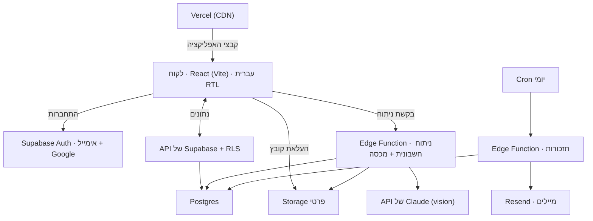

# PRD — אחריות+

**גרסה:** 1.1 · **סטטוס:** מאושר, סעיף אחר סעיף (15/09/2026), עודכן 19/09/2026 · **מחבר:** רפאל בלחסן
**קורס:** AI-Augmented Web Development · יריב גלעד
**שם המוצר:** «אחריות+» הוא שם זמני.

> המסמך מתאר **מה** האפליקציה עושה. **איך** היא נראית — ב־`DESIGN.md`. **באיזה סדר** בונים — ב־`TASK-PLAN.md`.
> פירוט המחקר והתכנון — ב־`docs/01` עד `docs/05`.

> **שינוי ב־1.1 (19/09/2026, החלטת רפאל):** האפליקציה מנהלת את האחריות של **כל קנייה עם אחריות**, לא רק מכשירי חשמל:
> רהיטים ומזרנים, רכב, אופניים וקורקינטים, ציוד צילום, כלי עבודה, ציוד לתינוקות ועוד.
> במסמך «מוצר» מחליף את «מכשיר», הקטגוריות והמיקומים הורחבו (5.6), והשדה «חדר» נקרא עכשיו «מיקום».
> המחקר (`docs/02`) וגודל השוק (סעיף 2) נשארו כפי שנכתבו: הם נמדדו על מכשירי חשמל.

## תוכן

1. סקירה
2. שוק ומתחרים
3. משתמשים
4. תפקידים והרשאות
5. דרישות פונקציונליות
6. תוכניות ומגבלות
7. Should · Could · מחוץ לתחום
8. דרישות לא־פונקציונליות
9. ארכיטקטורה
10. מדדי הצלחה
11. סיכונים ושאלות פתוחות
12. סדר עדיפויות בין המסמכים

---

## 1. סקירה

### הבעיה
משפחות בישראל קונות לאורך השנים עשרות מוצרים יקרים עם אחריות — מכשירי חשמל, רהיטים, רכב, אופניים חשמליים — ומתקשות למצוא את החשבונית, את תאריך סיום האחריות ואת איש הקשר הנכון, כשהן רוצות לתקן מוצר שהתקלקל.

### הפתרון
אפליקציית ווב שבה מצלמים את החשבונית: הבינה המלאכותית ממלאת את כרטיס המוצר, האפליקציה שומרת במקום אחד את החשבונית, האחריות ואנשי הקשר, ומתריעה לפני שהאחריות מסתיימת.

### הצעת הערך
בניגוד לאפליקציות אחריות זרות, האפליקציה שלנו מדברת עברית, מכירה את כללי האחריות בישראל ואומרת לך בדיוק למי להתקשר ביום התקלה — המוכר, היבואן או המתקין.

### מטרת הפרויקט
אפליקציה חיה (Vercel + Supabase) שבה חמשת ה־Must עובדים מקצה לקצה, לפי מדדי המסירה בסעיף 10.

---

## 2. שוק ומתחרים

### גודל השוק

| רמה | הגדרה | הערכה |
|---|---|---|
| **TAM** | כל מי שיש לו את הבעיה | כמעט כל משקי הבית בישראל, ועוד עצמאים ודירות Airbnb: **כ־3.4 מיליון** |
| **SAM** | החלק שאפשר להגיע אליו בפועל | משקי הבית המאובזרים ביותר (מדיח כלים כמדד): **כ־1.34 מיליון** ⚠️ השערה |
| **SOM** | מה שאפשר לתפוס בשנה–שנתיים בלי תקציב שיווק | **1% מה־SAM ≈ 13,400 משקי בית** ⚠️ השערה |

**מקורות:** 2,920,300 משקי בית (הלמ"ס, *Israel in Figures 2024*) · 97.9% עם מכונת כביסה, 96.8% עם מזגן, 45.9% עם מדיח (הלמ"ס, סקר הוצאות משק הבית 2022) · 11,000–14,000 מודעות Airbnb פעילות (AirROI דרך בלוג, תחילת 2026 — מקור חלש) · 466,588 עסקים של יחידים (הלמ"ס, הודעה 036/2024).

**כמה מוציאים היום:** 660 ₪ בחודש על ריהוט וציוד לבית (הלמ"ס 2022) · **47,903** פניות לרשות להגנת הצרכן ב־2025, ומוצרי חשמל הם הענף הראשון בתלונות · זמן שמושקע בחיפוש: לא נמצאה מדידה.

### מתחרים

| יכולת | Itemtopia | TrackWarranty | HomeZada | FOLDI 🇮🇱 | **אחריות+** |
|---|---|---|---|---|---|
| קריאת חשבונית בבינה מלאכותית | ✅ | ✅ | ? | ? | ✅ |
| תזכורות לפני סוף האחריות | ✅ | ✅ | ? | ✅ (כללי) | ✅ |
| אחריות מורחבת בנפרד | ? | ? | ? | ? | ✅ |
| 3 אנשי קשר נפרדים לכל מוצר | ? | ? | ? | ? | ✅ |
| מקור כל תאריך מוצג | ? | ? | ? | ? | ✅ |
| סידור לפי חדר | ✅ | ? | ✅ | ? | ✅ |
| כמה נכסים | ✅ | ? | ✅ | ? | Should |
| שיתוף עם הרשאות | ✅ | ? | ? | ? | ✅ |
| ממשק בעברית | ❌ | ❌ | ? | ✅ | ✅ |
| כללי אחריות ישראליים | ? | ? | ? | ? | ✅ |

✅ נראה בעמוד שלהם · ❌ נבדק שאין · ? אי אפשר לאמת. פירוט, מחירים ומתחרים עקיפים — `docs/02-research.md`.

**מסקנות:**
1. **אין מתחרה ישיר פעיל בעברית.** Warranteer הישראלית נרכשה על ידי ironSource ב־07/11/2016 ואינה פעילה; סגירה רשמית לא הוכחה.
2. **תזכורות אינן יתרון מבדל**: TrackWarranty כבר שולחת ב־90, 30 ו־7 ימים.
3. **מה שאף אחד לא מציע באופן מאומת**: עברית, כללי האחריות בישראל, 3 אנשי קשר נפרדים ומקור כל תאריך.

---

## 3. משתמשים

### פרסונות
| | תיאור קצר | צורך מרכזי |
|---|---|---|
| **נועה (ראשית)** | בת 37, מודיעין, נשואה לאייל, 2 ילדים, כעשרים מוצרים | לתקן מהר ובחינם מה שעדיין באחריות, ולדעת למי להתקשר |
| **רונן** | בן 51, תל אביב, מנהל 3 דירות Airbnb שלו ו־2 של בעלים בחו"ל | שתקלה לא תעלה לו הזמנה, ולתת לבעלים דין וחשבון |
| **מאיה** | בת 31, חיפה, צלמת חתונות, עוסקת מורשית | שתקלה לא תעצור את העבודה באמצע העונה |

### סיפורי משתמש

| # | סיפור | כיסוי |
|---|---|---|
| US1 | בתור הורה עסוק, אני רוצה לצלם את החשבונית בקופה ולראות את כרטיס המוצר מתמלא לבד, כדי לא להקליד כלום. | M2 |
| US2 | בתור הורה עסוק, אני רוצה לבדוק ולתקן את מה שהבינה המלאכותית קראה לפני השמירה, כדי לוודא שתאריך האחריות נכון. | M2 |
| US3 | בתור הורה עסוק, ביום שמכונת הכביסה מתקלקלת, אני רוצה לראות במסך אחד אם היא עדיין באחריות ולהתקשר לאיש הקשר הנכון בלחיצה, כדי לתקן אותה בלי לחפש. | M3 |
| US4 | בתור הורה עסוק, אני רוצה לקבל מייל לפני שאחריות מסתיימת, כדי לא לגלות מאוחר מדי שהיא נגמרה. | M5 |
| US5 | בתור הורה עסוק, אני רוצה להוסיף מוצר ישן בלי חשבונית, עם משך אחריות משוער שמסומן ככזה, כדי שכל הבית יהיה באפליקציה. | M2 |
| US6 | בתור הורה עסוק, אני רוצה להזמין את בן או בת הזוג בצפייה בלבד, כדי שימצאו את מספר הטכנאי בלי לשנות כרטיס בטעות. | M1 |
| US7 | בתור מי שמנהל כמה דירות, אני רוצה לסדר כל מוצר לפי דירה ולפי חדר, כדי לדעת מיד על איזה מזגן האורח מדבר. | Should |
| US8 | בתור מי שמנהל כמה דירות, אני רוצה ליצור מרחב לכל בעל דירה ולהזמין אותו בצפייה בלבד, כדי לתת לו דין וחשבון בלי לשלוח קבצים. | M1 |
| US9 | בתור עצמאית עם ציוד מקצועי, אני רוצה לראות בראש הדשבורד את האחריות שמסתיימת בתוך 90 יום, כדי לשלוח את הציוד לבדיקה לפני עונת החתונות. | M4 |
| US10 | בתור עצמאית עם ציוד מקצועי, אני רוצה שהבינה המלאכותית תכין את ההודעה לשירות הלקוחות עם הדגם, תאריך הקנייה והחשבונית, כדי לא לבזבז שעה על כתיבה. | Should |

### המסלול האידיאלי
דף הבית ← הרשמה עם Google ← יצירת מרחב ← דשבורד ← הוספת מוצר ← צילום חשבונית ← בדיקת הפרטים ← כרטיס המוצר.

---

## 4. תפקידים והרשאות

| פעולה | גישה מלאה | צפייה בלבד |
|---|---|---|
| צפייה בדשבורד, במוצרים, בכרטיסים ובהתראות | ✅ | ✅ |
| התקשרות לאנשי קשר, פתיחה והורדה של מסמכים | ✅ | ✅ |
| הוספה, עריכה ומחיקה של מוצרים, אנשי קשר, אחריות מורחבת ומסמכים | ✅ | ❌ הכפתורים לא מוצגים |
| צפייה בחברי המרחב | ✅ | ✅ |
| הזמנה, שינוי הרשאה והסרה של חברים | ✅ | ❌ |
| עזיבת המרחב | ✅ | ✅ |
| מחיקת המרחב | רק יוצר המרחב | ❌ |
| כיבוי התזכורות שלי | ✅ | ✅ |

- **יוצר המרחב** תמיד בגישה מלאה, ואי אפשר להסיר אותו.
- **הסתרת כפתור היא חוויית משתמש, לא אבטחה.** אותם כללים נאכפים בשרת (RLS) בשלב 8.

---

## 5. דרישות פונקציונליות

כל דרישה כוללת קריטריוני קבלה. בסוגריים: קודי המסכים ב־Stitch (תיקייה `stitch/`).

### M1 · חשבון ומרחב

**FR-1.1 הרשמה** — עם Google או באימייל וסיסמה. *(A7–A11)*
- כפתור Google מופיע ראשון.
- סיסמה של 8 תווים לפחות, עם מד חוזק.
- אישור תנאי השימוש ומדיניות הפרטיות הוא חובה.
- אחרי הרשמה באימייל מוצג «בדקו את תיבת המייל», ואין כניסה לפני האימות. קישור אימות שפג: «שליחת הקישור שוב».

**FR-1.2 התחברות** *(A1–A6, A18–A20)*
- אותה הודעה בדיוק לאימייל שלא קיים ולסיסמה שגויה: «האימייל או הסיסמה לא נכונים».
- אחרי 5 ניסיונות כושלים: חסימה ל־5 דקות, עם הסבר ואפשרות לאפס סיסמה.
- אימייל שלא אומת: הודעה עם שליחה חוזרת של הקישור.
- ביטול או כישלון של Google: חזרה למסך, בלי שגיאה טכנית.
- סשן שפג תוקפו או חשבון מושבת: הודעה ברורה וחזרה להתחברות.

**FR-1.3 שכחתי סיסמה** *(A12–A17)*
- קישור איפוס באימייל, תקף שעה.
- «הקישור נשלח» מוצג גם כשהאימייל לא קיים.
- קישור שפג תוקפו: «בקשת קישור חדש».
- סיסמה חדשה: 8 תווים לפחות, מד חוזק, ושני השדות זהים.

**FR-1.4 כניסה ראשונה** — משתמש בלי מרחב מגיע למסך «יצירה או הצטרפות». *(O1–O5)*
- יצירה: סוג המרחב («משפחה ובית» / «עסק או כמה דירות») ושם — שניהם חובה.
- הצטרפות: קוד של 6 תווים.
- הודעה אחת לקוד שגוי ולקוד שפג תוקפו.
- בסיום: מעבר לדשבורד.

**FR-1.5 הזמנה** — חבר עם גישה מלאה מזמין. *(M1–M2)*
- ההרשאה נבחרת לפני יצירת הקוד.
- קוד של 6 תווים, תקף 7 ימים, עם שיתוף (למשל בוואטסאפ) והעתקה.
- בתוכנית חינם: מוזמן אחד, בצפייה בלבד. בפרו ובפרו לניהול נכסים: בלי הגבלה.

**FR-1.6 שני תפקידים** — גישה מלאה / צפייה בלבד (סעיף 4). *(D4, F6)*
- בצפייה בלבד, הכפתורים הוספה, עריכה, מחיקה והזמנה **לא מוצגים** (לא רק מושבתים).
- כניסה לכתובת של דף עריכה או הוספה בצפייה בלבד מחזירה לכרטיס או לדשבורד.
- בשלב 8 אותו כלל נאכף בשרת (RLS).

**FR-1.7 ניהול חברים** *(M3–M5, P4–P5)*
- שינוי הרשאה והסרה, עם אישור.
- כל חבר יכול לעזוב את המרחב.
- אי אפשר להסיר את יוצר המרחב, ורק הוא יכול למחוק את המרחב, בהקלדת שם המרחב.

**FR-1.8 כמה מרחבים** — בורר מרחבים בכותרת, עם «יצירת מרחב נוסף». *(O6)*
- המרחב הפעיל מוצג תמיד.
- אחרי החלפה, כל המסכים מציגים רק את נתוני המרחב שנבחר.

**FR-1.9 חשבון** — עריכת פרופיל, שינוי סיסמה, התנתקות, מחיקת חשבון. *(P1–P3, P6, ME6)*
- שינוי סיסמה מנתק את שאר המכשירים.
- מחיקת החשבון דורשת להקליד «מחיקה», ונשלח אימייל אישור.

### M2 · הוספת מוצר

**FR-2.1 ארבע דרכים** — צילום חשבונית · העלאת קובץ PDF · צילום התווית · הזנה ידנית. *(N1, D2)*
- התפריט מציג כמה סריקות נותרו החודש.
- בצפייה בלבד אין כפתור הוספה.

**FR-2.2 צילום והעלאה** *(N2, N3, N8)*
- בטלפון נפתחת **המצלמה של הטלפון עצמו** (לא מצלמה מותאמת בתוך האפליקציה); במחשב נפתחת בחירת קובץ.
- תצוגה מקדימה עם «צילום מחדש» / «שימוש בתמונה».
- תמונה או PDF עד 10MB; כל קובץ אחר נדחה עוד בדפדפן, לפני ההעלאה.

**FR-2.3 מכסת סריקות** *(N10)*
- הבדיקה נעשית בשרת, לא בדפדפן.
- צילום התווית נספר כסריקה.
- רק קריאה מוצלחת נספרת: חשבונית לא קריאה ושירות לא זמין לא נספרים.
- כשהמכסה נגמרה: «הזנה ידנית» או «לתוכניות», עם תאריך החידוש (ה־1 בחודש).

**FR-2.4 ניתוח** *(N4)*
- מסך התקדמות בשלבים, בלי אחוזים, עם «ביטול».
- מוחזרים: שם, קטגוריה (מהרשימה הסגורה, 5.6), מותג, דגם, מספר סידורי, תאריך רכישה, מוכר, משך האחריות.
- הקריאה נקטעת אחרי 30 שניות ומוצג N9.

**FR-2.5 בדיקה לפני שמירה** *(N5, N13)*
- **שום מוצר לא נשמר לפני «שמירה».**
- כל שדה ניתן לעריכה.
- שדה שהקריאה לא ודאית בו מסומן «לבדוק».
- «הצגת החשבונית» פותחת את הקובץ.
- דגם ומספר סידורי מוצגים משמאל לימין.

**FR-2.6 כמה מוצרים בחשבונית** *(N6)*
- בוחרים מוצר אחד.
- אחרי השמירה אפשר להוסיף מוצר נוסף מאותה חשבונית, בלי סריקה נוספת.

**FR-2.7 כשהקריאה נכשלת** *(N7, N9)*
- חשבונית לא קריאה: «צילום מחדש» או «הזנה ידנית».
- שירות לא זמין: «לנסות שוב» או «הזנה ידנית», והסריקה לא נספרת.
- בשני המקרים הקובץ עובר להזנה הידנית ולא הולך לאיבוד.

**FR-2.8 הזנה ידנית** *(N11, N12)*
- רק «שם המוצר» הוא שדה חובה.
- תאריך רכישה לא יכול להיות בעתיד.
- השגיאה מופיעה מתחת לשדה, ובראש הטופס «יש X שדות לתיקון».

**FR-2.9 מקור התאריך** *(F4, F5)*
- סדר עדיפות: מה שהמשתמש הזין › מה שכתוב במסמך › משך משוער לפי קטגוריה.
- **משך משוער ב־V1: 12 חודשים לכל הקטגוריות** (המינימום לפי תקנות הגנת הצרכן, 2006, למוצרי חשמל, אלקטרוניקה וגז מעל 150 ₪).
- בקטגוריות שמחוץ לתקנות (רהיטים, רכב, אופניים ועוד), 12 החודשים הם הערכה בלבד, ולכן התג «משוער» ותאריך מהמסמך חשובים שם במיוחד.
- המקור מוצג תמיד («מהחשבונית» / «מתעודת האחריות» / «הוזן ידנית» / «משוער לפי קטגוריה»).
- בלי תאריך רכישה, המוצר נשמר כ«תאריך לא ידוע» ולא נכנס לתזכורות.

**FR-2.10 מיקום** — בחירה מהרשימה הסגורה (5.6): חדר בבית, מרפסת וחצר או חניה.

### M3 · כרטיס מוצר

**FR-3.1 פרטי המוצר** — שם, קטגוריה, מיקום, מותג, דגם ומספר סידורי (משמאל לימין). *(F1, W3)*
- בראש הכרטיס **אייקון הקטגוריה**; אין תמונת מוצר ב־V1.
- אחרי שמירה מופיעה ההודעה «המוצר נשמר».
- במחשב, שתי עמודות: התו מימין, אנשי הקשר והמסמכים משמאל.

**FR-3.2 תו האחריות** — שלושה פסים (מוגנת · מסתיימת בקרוב · הסתיימה) וחץ עם הזמן שנותר. *(F1, F3)*
- יותר מ־90 יום = מוגנת · 90 יום ומטה = מסתיימת בקרוב · אחרי התאריך = הסתיימה.
- עד 90 יום מוצגים ימים; מעל 90 יום, חודשים.
- כשהאחריות הסתיימה: «לפני X» ו«אנשי הקשר נשארים זמינים כאן».

**FR-3.3 אחריות רגילה ומורחבת** *(F2, F11)*
- ליד כל תאריך מוצג המקור שלו.
- **עם אחריות מורחבת, התו סופר עד סוף האחריות המורחבת.**
- הוספת אחריות מורחבת: מי נותן אותה, תאריך התחלה, תאריך סיום (מאוחר מתאריך ההתחלה), תעודה לא חובה.

**FR-3.4 מידע חסר** *(F4, F5)*
- תאריך לא ידוע: פסים בלי חץ ו«להשלים תאריך».
- תאריך משוער: תג «משוער» וקישור «יש לכם את התאריך המדויק? לעדכון».
- אין חשבונית: «הוספת חשבונית».

**FR-3.5 למי להתקשר** — שלושה סוגים: מוכר · יבואן או יצרן · מתקין. *(F1, F10)*
- **איש קשר אחד לכל סוג** (3 לכל היותר).
- שם חובה, ולפחות טלפון או אימייל.
- איש קשר אחד מסומן «ראשי», והוא המוצג בדשבורד.
- **המוכר שנקרא מהחשבונית נוצר אוטומטית** כאיש קשר (שם, וטלפון אם מופיע).
- לחיצה מחייגת או פותחת מייל; טלפון, אימייל ואתר מוצגים משמאל לימין.

**FR-3.6 מסמכים** — חשבונית · תעודת אחריות · אישור התקנה · אחר. *(F7, F12)*
- תמונה או PDF עד 10MB.
- רק חברי המרחב רואים את המסמכים, דרך קישור זמני.
- במסך המסמך: הגדלה, הורדה, שיתוף, החלפת קובץ, מחיקה עם אישור.

**FR-3.7 עריכה ומחיקה** *(F8, F9)*
- טופס העריכה זהה לטופס ההזנה הידנית.
- תאריך ששונה ביד מקבל את המקור «הוזן ידנית».
- המחיקה דורשת אישור, מוחקת גם את המסמכים והתזכורות, ואי אפשר לבטל אותה.

**FR-3.8 צפייה בלבד** *(F6)*
- רואים הכול ומתקשרים; אפשר לפתוח ולהוריד מסמכים.
- לא מוצגים: העיפרון, «להוסיף», «הוספת איש קשר», «הוספת מסמך», «החלפת קובץ» ו«מחיקה».
- מתחת לשם מופיע התג «צפייה בלבד».

### M4 · דשבורד ורשימת המוצרים

**FR-4.1 ראש הדשבורד** — ברכה לפי השעה, בורר המרחב ופעמון ההתראות. *(D1)*
- **המספר הגדול = מוצרים באחריות פעילה (כולל «מסתיימת בקרוב») מתוך כל המוצרים.** בנתוני הדוגמה: 17 / 18.
- מקטע בפס לכל מוצר: לבן מוגנת, זעפרן מסתיימת בקרוב, אדום הסתיימה, אפור תאריך לא ידוע. מעל 30 מוצרים, הפס מחולק לפי אחוזים.
- מתחת לפס, שורת סיכום בטקסט (למשל «2 מסתיימות בקרוב · 1 הסתיימה»), כי הצבע לבדו לא מספיק (NFR-2).
- נקודה על הפעמון כשיש התראה שלא נקראה.

**FR-4.2 לטיפול עכשיו** *(D1, D3)*
- מוצג המוצר שהאחריות שלו מסתיימת הכי קרוב (בתוך 90 יום), עם איש הקשר הראשי וקישור לכרטיס.
- אם יש עוד: «ועוד X מסתיימות בקרוב», שמוביל ללשונית ברשימה.
- אם אין: «אין כרגע משהו לטפל בו. ניידע אתכם 90 ימים לפני שאחריות מסתיימת.»

**FR-4.3 נוספו לאחרונה** *(D1, W1)*
- 3 המוצרים האחרונים שנוספו (6 במחשב), כל אחד עם הסטטוס שלו, וקישור «לכל המוצרים».

**FR-4.4 מצבי הדשבורד** *(D2, D4, D5, E4)*
- מרחב ריק: «הבית שלכם מתחיל כאן», עם «צילום חשבונית» ו«הזנה ידנית». בצפייה בלבד: משפט בלי כפתורים.
- טעינה: שלד באותה צורה, בלי ספינר.
- בלי אינטרנט: פס עליון «אין חיבור לאינטרנט», המידע שכבר נטען נשאר, וההוספה מושבתת. אין אחסון במוצר (PWA = Could).
- בצפייה בלבד: תג «צפייה בלבד» ובלי «צילום חשבונית».

**FR-4.5 רשימת המוצרים** *(L1, L4)*
- לשוניות עם מונה: הכול · מסתיימת בקרוב · הסתיימה · תאריך לא ידוע.
- קיבוץ לפי מיקום, ובתוך כל מיקום מהקרוב לסיום אל הרחוק; «תאריך לא ידוע» בסוף.
- בכל שורה: אייקון קטגוריה, שם, נקודת צבע וסטטוס («עוד X», «הסתיימה לפני X», «תאריך לא ידוע», ו«· משוער» כשצריך).
- לשונית ריקה: הודעה מרגיעה.

**FR-4.6 חיפוש** — לפי שם, מותג או דגם, בתוך המרחב הפעיל. *(L2)*
- התוצאות מתעדכנות בזמן ההקלדה.
- בזמן החיפוש הלשוניות מוסתרות.
- אין תוצאות: «לא מצאנו את "X"» ו«ניקוי החיפוש».

**FR-4.7 סינון** — מיקום · קטגוריה · מקור התאריך · שנת רכישה. *(L3)*
- הכפתור מראה כמה מוצרים יוצגו («הצגת 3 מוצרים»).
- «ניקוי הסינון».
- כשיש סינון פעיל, על כפתור «סינון» מופיע מספר המסננים.

**FR-4.8 ניווט** *(W1, W2)*
- בטלפון, סרגל תחתון: בית · מוצרים · התראות · הגדרות.
- מ־1024px, סרגל צד מימין: בית · מוצרים · התראות · חברי המרחב · הגדרות, ו«צילום חשבונית» בתחתיתו.
- במחשב הרשימה היא טבלה: מוצר, מיקום, מותג, סטטוס, סיום האחריות, מקור.

### M5 · תזכורות והתראות

**FR-5.1 מתי נשלחת תזכורת** — 90, 30 ו־7 ימים לפני סוף הכיסוי. *(ME3, ME5)*
- בדיקה פעם ביום, ב־08:00 שעון ישראל.
- כל מדרגה נשלחת פעם אחת בלבד לכל מוצר.
- **עם אחריות מורחבת, התזכורות נקבעות לפי סוף המורחבת בלבד.**
- מוצר שנוסף כשנשארו, למשל, 20 יום: נשלחת רק המדרגה הקרובה, עם מספר הימים האמיתי. אותו כלל מכסה יום שבו הבדיקה לא רצה.
- תאריך לא ידוע או אחריות שהסתיימה: אין תזכורת.
- תאריך משוער: התזכורת נשלחת וכתוב בה «תאריך משוער».

**FR-5.2 מי מקבל** *(P1)*
- כל חברי המרחב, גם בצפייה בלבד.
- שלושת המתגים (90 / 30 / 7) פעילים כברירת מחדל, וכל חבר יכול לכבות אותם בהגדרות שלו.

**FR-5.3 תוכן המייל** *(ME3, ME5)*
- כותרת עם שם המוצר ומספר הימים.
- תו אחריות מוקטן, תאריך הסיום והמקור שלו.
- «למי להתקשר» עם שלושת אנשי הקשר והטלפונים (משמאל לימין).
- כפתור «לכרטיס המוצר».
- במדרגת 7 הימים: «אם יש תקלה, זה הזמן לפנות, כל עוד המוצר באחריות.»
- בתחתית: למה נשלח המייל, וקישור «שינוי התזכורות».
- המייל כתוב מימין לשמאל וקריא גם כשהתמונות חסומות.

**FR-5.4 הקישור שבמייל**
- משתמש מחובר: נפתח כרטיס המוצר.
- משתמש לא מחובר: התחברות, ואחריה חזרה לאותו כרטיס.
- מוצר שנמחק בינתיים: הודעה ומעבר לרשימה.

**FR-5.5 כשהשליחה נכשלת** *(T1)*
- נוצרת ההתראה «לא הצלחנו לשלוח תזכורת במייל. ננסה שוב מחר.»
- ניסיון חוזר פעם ביום, עד שהמייל נשלח או עד שהאחריות מסתיימת.

**FR-5.6 מרכז ההתראות** *(T1, T2)*
- לשוניות: הכול · אחריות · מרחב. קבוצות «השבוע» ו«קודם».
- התראה שלא נקראה מודגשת, ומופיעה נקודה על הפעמון.
- לחיצה מסמנת כנקראה ופותחת את היעד (הכרטיס או חברי המרחב).
- «סימון הכול כנקרא». הסימון נשמר לכל חבר בנפרד.
- מצב ריק: «אין התראות חדשות» ו«ניידע אתכם 90, 30 ו־7 ימים לפני שאחריות מסתיימת.»

**FR-5.7 אירועי מרחב** — חבר הצטרף או עזב, מוצר נוסף. *(T1)*
- ההתראה מוצגת לשאר החברים, לא למי שביצע את הפעולה.

**FR-5.8 מיילים נוספים** — אימות אימייל · איפוס סיסמה · מחיקת חשבון · ביטול מנוי (Should). *(ME1, ME2, ME4, ME6)*
- כולם באותה תבנית (רוחב 600px, פס עליון כחול לילה עם הלוגו).
- במייל מחיקת החשבון אין כפתור.

### 5.6 רשימות קבועות

| רשימה | ערכים |
|---|---|
| קטגוריות (18) | מקרר · מכונת כביסה ומייבש · מדיח כלים · תנור וכיריים · מכשירי מטבח קטנים · מזגן · טלוויזיה ושמע · מחשב וטלפון · שואב אבק · דוד ומערכות בבית · רהיטים ומזרנים · רכב ואופנוע · אופניים וקורקינטים · מצלמות וציוד צילום · כלי עבודה וגינה · ציוד לתינוקות · ספורט וכושר · אחר |
| מיקומים | מטבח · סלון · חדר שינה · חדר כביסה · חדר רחצה · משרד · חדר ילדים · מרפסת וחצר · חניה · אחר |
| משך משוער | 12 חודשים לכל קטגוריה (V1). טבלה לפי קטגוריה = Could |
| סוגי אנשי קשר | מוכר · יבואן או יצרן · מתקין |
| סוגי מסמכים | חשבונית · תעודת אחריות · אישור התקנה · אחר |
| מקורות תאריך | מהחשבונית · מתעודת האחריות · הוזן ידנית · משוער לפי קטגוריה |
| סטטוסים | מוגנת (> 90 יום) · מסתיימת בקרוב (≤ 90 יום) · הסתיימה · תאריך לא ידוע |

---

## 6. תוכניות ומגבלות

| | **חינם** | **פרו** | **פרו לניהול נכסים** |
|---|---|---|---|
| מחיר | 0 ₪ | 19 ₪ לחודש או 149 ₪ לשנה | 59 ₪ לחודש או 590 ₪ לשנה |
| הזנה ידנית | ללא הגבלה | ללא הגבלה | ללא הגבלה |
| סריקות בחודש | 5 | עד 40 | עד 100 |
| נכסים (Should) | 1 | עד 3 | עד 10 |
| חברים מוזמנים | 1, בצפייה בלבד | ללא הגבלה | ללא הגבלה |
| תזכורות במייל | ✅ | ✅ | ✅ |
| הודעה לשירות הלקוחות (Should) | ❌ | ✅ | ✅ |
| העברת חשבוניות במייל (Should) | ✅ | ✅ | ✅ |
| עוזר לקריאה בלבד (Should) | ✅ | ✅ | ✅ |

- **המחירים הם השערות השקה.** התשלום מדומה (Should); אין תשלום אמיתי ב־V1.
- הסריקות מתחדשות ב־1 בחודש; קריאה שנכשלה לא נספרת.
- **ביטול**: קישור «ביטול מנוי» גלוי בדף הבית (סעיף 14ט לחוק הגנת הצרכן); החוזה מסתיים תוך 3 ימי עסקים מהודעת הביטול (סעיף 13ד(ג)).
- **LTV מול UAC** (השערות, לא נתונים שנמדדו):

| תרחיש | LTV נטו | UAC | תוצאה |
|---|---|---|---|
| משפחה, מפה לאוזן | 248 ₪ (149 ₪ × 2 שנים, פחות 50 ₪ עלויות) | 30 ₪ | רווחי |
| מנהל נכסים, דרך שותפות | 1,175 ₪ (590 ₪ × 2.5 שנים, פחות 300 ₪) | 250 ₪ | רווחי |
| משפחה, דרך פרסום ממומן | 248 ₪ | 300 ₪ | **לא רווחי** |

- **נקודת השוואה**: המרה חציונית של 2.1% מהתקנה למנוי בתוך 35 יום במודל freemium (RevenueCat, *State of Subscription Apps 2026*).

---

## 7. Should · Could · מחוץ לתחום

**Should** (אחרי חמשת ה־Must)
- כמה נכסים (US7) *(X1–X2)*
- הודעה לשירות הלקוחות שנכתבת בבינה מלאכותית (US10) *(X3)*
- תוכניות מדומות: דף תמחור, «התוכנית שלי», ביטול מנוי *(S4, P9–P12, ME4)*
- עוזר בינה מלאכותית לקריאה בלבד *(X4)*
- העברת חשבוניות במייל *(X5)*
- שאר האתר הציבורי: שאלות נפוצות, יצירת קשר, תנאי שימוש, מדיניות פרטיות, הצהרת נגישות, ביטול מנוי *(S3–S10)*

### פירוט ה־Should באפליקציה

> נוסף ב־16/09/2026 (החלטת רפאל: לבנות את האפליקציה במלואה לפני תוצרי הקורס).
> בשלב 6 כל אלה עובדים על נתוני הדוגמה; הבינה המלאכותית, התשלום והמיילים מדומים, ומחוברים בשלב 8.
> **מדיניות הפרטיות מתעדכנת בהתאם**: פרטי המוצר נשלחים לשירות הבינה המלאכותית גם כדי לכתוב הודעה
> לשירות הלקוחות ולענות בעוזר, ומיילים שמועברים לכתובת המרחב נקראים רק כדי למצוא בהם חשבונית.

#### FR-6 · התוכנית שלי *(P9–P12)*

**FR-6.1 מסך התוכנית** — `/settings/plan`, מ«הגדרות › החשבון › התוכנית שלי». *(P9)*
- התוכנית הנוכחית: שם, מחיר ותקופת החיוב («149 ₪ לשנה»), ו«מתחדשת ב־DD/MM/YYYY». בחינם: «0 ₪».
- שימוש: «סריקות החודש: 3 מתוך 5» ותאריך החידוש (ה־1 בחודש).
- כשהמרחב הפעיל שלכם: «נכסים: 1 מתוך 1» ו«חברים מוזמנים: 1 מתוך 1» (בפרו: «ללא הגבלה»).
  כשהמרחב של מישהו אחר: «המגבלות של המרחב הזה נקבעות לפי התוכנית של מי שיצר אותו.»
- ליד כל מגבלה שהגעתם אליה: «הגעתם למגבלה». המספר תמיד כתוב, לא רק פס (NFR-2).
- פעולות: «שינוי תוכנית», ובתוכנית בתשלום גם «ביטול המנוי».

**FR-6.2 שינוי תוכנית** *(P10, P11)*
- שלוש התוכניות מסעיף 6, עם חיוב חודשי או שנתי (ברירת מחדל: שנתי). על התוכנית הנוכחית: «התוכנית שלכם», בלי כפתור.
- מסך אישור: שם התוכנית, המחיר ותקופת החיוב, ומה משתנה (סריקות, נכסים, מוזמנים, הודעה לשירות הלקוחות).
- **התשלום מדומה** (סעיף 6): אין שדות של כרטיס אשראי, ובמסך כתוב «זו הדגמה: לא תחויבו.»
- «אישור» → חזרה למסך התוכנית עם «התוכנית עודכנה». המגבלות החדשות חלות מיד.
- מעבר לתוכנית קטנה יותר: **שום דבר לא נמחק**. מה שמעל המגבלה נשאר, ואי אפשר להוסיף עוד עד שיורדים
  מתחתיה. מסך האישור אומר את זה במפורש.
- מעבר לחינם = ביטול המנוי (FR-6.3).

**FR-6.3 ביטול המנוי** *(P12, ME4)*
- «ביטול המנוי» פותח דיאלוג: «המנוי יסתיים ב־DD/MM/YYYY. המוצרים, המסמכים והתזכורות נשמרים,
  והחשבון יעבור לתוכנית החינמית.» התאריך: 3 ימי עסקים (ראשון עד חמישי) מהיום (סעיף 13ד(ג)).
- אחרי האישור, במסך התוכנית: «המנוי בוטל. התוכנית פעילה עד DD/MM/YYYY», עם «חידוש המנוי» שמבטל את הביטול.
- נשלח מייל אישור (ME4, שלב 8). הביטול בלי התחברות נשאר בעמוד הציבורי (S10).

**FR-6.4 של מי התוכנית**
- התוכנית שייכת למשתמש. **מגבלות המרחב** (נכסים, מוזמנים, הודעה לשירות הלקוחות) נקבעות לפי התוכנית של
  יוצר המרחב. **מכסת הסריקות** נקבעת לפי התוכנית של מי שסורק.
- חבר שאינו יוצר המרחב ומגיע למגבלה של המרחב רואה «רק מי שיצר את המרחב יכול לשנות את התוכנית», בלי «לתוכניות».

#### FR-7 · כמה נכסים *(X1–X2, US7)*

**FR-7.1 נכס** — דירה, בית או מקום אחר בתוך מרחב. *(X1)*
- כל מרחב נפתח עם נכס אחד, בשם המרחב. **כל עוד יש נכס אחד, הממשק לא מזכיר נכסים**, מלבד השורה
  «נכסים» בהגדרות, שממנה מוסיפים את השני.
- כמה נכסים במרחב: לפי התוכנית של יוצר המרחב — 1 · עד 3 · עד 10 (סעיף 6).

**FR-7.2 ניהול הנכסים** — «הגדרות › המרחב › נכסים» (`/settings/properties`), בגישה מלאה בלבד. *(X1)*
- רשימה: שם הנכס ומספר המוצרים בו.
- «הוספת נכס»: שם, חובה, עד 40 תווים, בלי כפילות במרחב («כבר יש נכס בשם הזה»).
- שינוי שם, באותם כללים.
- מחיקה עם אישור, רק לנכס בלי מוצרים ורק כשיש יותר מנכס אחד. לנכס עם מוצרים:
  «כדי למחוק את הנכס, העבירו קודם את המוצרים שבו לנכס אחר או מחקו אותם.»
- במגבלה, במקום «הוספת נכס»: «בתוכנית שלכם אפשר עד 3 נכסים» ו«לתוכניות» (FR-6.4).

**FR-7.3 מוצר בנכס** *(X2)*
- כשיש יותר מנכס אחד, בטופס המוצר (הזנה ידנית, בדיקה אחרי סריקה, עריכה) מופיע השדה «נכס», חובה, לפני
  «מיקום». ברירת מחדל: הנכס שנבחר בסינון (FR-7.4), ואם נבחרו «כל הנכסים» — הראשון.
- בכרטיס המוצר, בשורת הפרטים: «נכס · מיקום» (למשל «הרצל 12 · מטבח»).
- בהתראות ובמייל התזכורת, אחרי שם המוצר מופיע שם הנכס.

**FR-7.4 סינון לפי נכס** *(X2)*
- כשיש יותר מנכס אחד, מתחת לראש הדשבורד ומעל רשימת המוצרים: «כל הנכסים» ואחריו נכס־נכס.
- הבחירה אחת לדשבורד ולרשימה, ונשמרת לכל משתמש בכל מרחב.
- כשנבחר נכס, הדשבורד (המספר הגדול, הפס, «לטיפול עכשיו», «נוספו לאחרונה») והרשימה (לשוניות, מונים,
  חיפוש, סינון) מציגים רק אותו.
- ב«כל הנכסים» הרשימה מקובצת לפי «נכס · מיקום», ובטבלה במחשב נוספת העמודה «נכס».

#### FR-8 · הודעה לשירות הלקוחות *(X3, US10)*

**FR-8.1 פתיחה** — בכרטיס המוצר, באזור «למי להתקשר»: «הודעה לשירות הלקוחות». *(X3)*
- לכל חברי המרחב, גם בצפייה בלבד: זו לא עריכה.
- כשהתוכנית של יוצר המרחב היא חינם: «הודעה שנכתבת בשבילכם זמינה בתוכנית פרו» עם «לתוכניות» (FR-6.4).
- בלי חיבור: הכפתור מושבת, «יהיה זמין כשהחיבור יחזור».

**FR-8.2 מה ממלאים**
- «למי?»: אנשי הקשר של המוצר, ברירת מחדל הראשי. בלי אנשי קשר: ההודעה נכתבת בלי פנייה בשם.
- «מה קרה?»: טקסט חופשי, חובה, עד 500 תווים («צריך לתאר מה קרה.»).
- «כתיבת ההודעה».

**FR-8.3 ההודעה**
- בזמן הכתיבה: «כותבים את ההודעה…», בלי אחוזים.
- תוכן: פנייה לנמען · שם המוצר, מותג, דגם ומספר סידורי (משמאל לימין) · תאריך הרכישה · סוף האחריות
  ומקור התאריך · מה קרה, בניסוח מנומס · בקשה לתיאום בדיקה · חתימה בשם המשתמש, וטלפון רק אם הוזן בפרופיל.
- **רק מה שכתוב בכרטיס.** תאריך משוער נכתב כ«משוער»; בתאריך לא ידוע אין משפט על האחריות.
- אפשר לערוך את ההודעה. **שום דבר לא נשלח אוטומטית.**
- פעולות: «העתקה» (→ «ההודעה הועתקה») · «שליחה בוואטסאפ» · «שליחה במייל», רק כשלאיש הקשר יש אימייל
  (נושא: «[שם המוצר] · פנייה בנושא אחריות»).
- כשיש חשבונית: ההודעה מציינת שהיא מצורפת, ובגיליון «הורדת החשבונית» כדי לצרף אותה.
- ההודעה לא נשמרת.

**FR-8.4 כשהכתיבה נכשלת**
- «לא הצלחנו לכתוב את ההודעה כרגע.» עם «לנסות שוב» ו«כתיבה בעצמכם» (פרטי המוצר כרשימה, להעתקה).
- בשלב 8: עצירה אחרי 30 שניות.

#### FR-9 · העברת חשבוניות במייל *(X5)*

**FR-9.1 כתובת למרחב** — «הגדרות › המרחב › העברת חשבוניות במייל» (`/settings/forwarding`), בגישה מלאה בלבד. *(X5)*
- לכל מרחב כתובת משלו, משמאל לימין, עם «העתקת הכתובת». הדומיין נקבע בשלב 8.
- «העבירו לכתובת הזאת מייל עם חשבונית בתמונה או ב־PDF. נקרא אותה, והיא תחכה כאן לבדיקה.»
- «כתובת חדשה» (עם אישור): הכתובת מתחלפת, והקודמת מפסיקה לעבוד.

**FR-9.2 מה מתקבל**
- רק ממייל שנשלח מהאימייל של חבר במרחב בגישה מלאה. מייל מכתובת אחרת לא נקרא ונמחק.
- כל קובץ מצורף (תמונה או PDF עד 10MB) הוא חשבונית נפרדת. מייל בלי קובץ מתאים: התראה לשולח
  «לא מצאנו חשבונית במייל ששלחתם».
- כל קריאה מוצלחת נספרת במכסה של השולח (FR-2.3). כשהמכסה נגמרה, החשבונית מחכה בלי קריאה.

**FR-9.3 ממתינות לבדיקה**
- במסך ההעברה: «ממתינות לבדיקה», ולכל חשבונית שם הקובץ, מי שלח, מתי, ומצב:
  «מוכנה לבדיקה» · «לא הצלחנו לקרוא» · «ממתינה לסריקה» (המכסה נגמרה).
- «מוכנה לבדיקה» → מסך הבדיקה (N5, או N6 כשיש כמה מוצרים). **שום מוצר לא נשמר לפני «שמירה»** (FR-2.5).
- «לא הצלחנו לקרוא» ו«ממתינה לסריקה» → הזנה ידנית עם הקובץ (FR-2.7).
- אחרי השמירה החשבונית יוצאת מהרשימה. «מחיקה» (עם אישור) מסירה אותה בלי לשמור.
- התראה לשולח: «חשבונית שהעברתם במייל מחכה לבדיקה» (לשונית «מרחב»).
- מצב ריק: «עוד לא הגיעו חשבוניות במייל.»

#### FR-10 · עוזר לקריאה בלבד *(X4)*

**FR-10.1 פתיחה** — בדשבורד: «שאלו את העוזר» (`/assistant`). לכל חברי המרחב ובכל התוכניות. *(X4)*
- במרחב בלי מוצרים הכפתור לא מוצג. בלי חיבור: מושבת, «יהיה זמין כשהחיבור יחזור».

**FR-10.2 שאלות ותשובות**
- שדה «שאלו על המוצרים שלכם», עד 300 תווים, ושלוש הצעות: «מה מסתיים בקרוב?» ·
  «למי מתקשרים כשמשהו מתקלקל?» · «לאילו מוצרים אין חשבונית?»
- העוזר עונה **רק לפי המידע במרחב הפעיל** ובנכס שנבחר (FR-7.4): מוצרים, תאריכים ומקורם, אנשי קשר ומסמכים.
- כל מוצר שמוזכר בתשובה מגיע עם קישור לכרטיס שלו. תאריך משוער נכתב כ«משוער».
- מה שלא נמצא במידע: «אין לי את המידע הזה במרחב.» העוזר לא ממציא ולא נותן ייעוץ משפטי.
- בזמן תשובה: «מחפשים במרחב…» ו«עצירה».

**FR-10.3 קריאה בלבד**
- העוזר לא מוסיף, לא משנה ולא מוחק. בקשה כזאת: «אני רק עונה על שאלות. אפשר לשנות את זה בכרטיס המוצר.»,
  עם קישור לכרטיס כשברור על איזה מוצר מדובר.
- אין לו גישה למרחבים אחרים, לחשבון או לתשלום.

**FR-10.4 השיחה**
- מתחת לשדה: «העוזר עונה לפי המידע במרחב. לפני החלטה, כדאי לבדוק בכרטיס המוצר.»
- **השיחה לא נשמרת**: כשיוצאים מהמסך, היא נמחקת. «שיחה חדשה» מנקה אותה.
- כישלון: «העוזר לא זמין כרגע. נסו שוב בעוד רגע.» עם «לנסות שוב».

**Could**
- התראות push ואפליקציה מותקנת (PWA)
- התחברות עם Microsoft ו־Apple *(A21)*
- הודעות SMS מדומות
- מצב כהה וערכות צבעים *(P8)*
- חבילות סריקות
- תזכורת לבדיקת מוצרים עונתיים
- טבלת משך אחריות לפי קטגוריה
- הורדת המידע שלי *(P7)*

**מחוץ לתחום (Won't, לא הפעם)**
- תשלום אמיתי ו־SMS אמיתיים
- אפליקציה נייטיב
- שותפויות B2B2C עם רשתות ויבואנים
- מע"מ והנהלת חשבונות
- מעקב אחרי תיקונים, פתיחת קריאות שירות
- תפקידים נוספים מעבר לשניים
- ארגונים גדולים עם אתרים, מחלקות וסניפים
- תמונות מוצרים
- אתר תוכן לקידום אורגני

---

## 8. דרישות לא־פונקציונליות

**NFR-1 עברית ו־RTL**
- `lang="he" dir="rtl"`; רק מאפייני CSS לוגיים (בלי left/right ובלי row-reverse).
- שם המותג, שמות קבצים ומחרוזות מעורבות עטופים ב־`<bdi>`, כדי למנוע את הבאג «pdf.2026_סמסונג» שנראה ב־N5.
- שדות קלט עם `dir="auto"`; טלפון, אימייל, דגם, מספר סידורי וקודים מוצגים משמאל לימין.
- תאריכים dd/mm/yyyy ומחירים ב־₪, דרך `Intl` ב־he-IL. אייקוני כיוון מתהפכים.

**NFR-2 נגישות** — ת"י 5568 (WCAG 2.0 AA)
- ניגודיות של 4.5:1 לפחות · פוקוס גלוי · כל פעולה אפשרית מהמקלדת.
- תווית לכל שדה, והשגיאה מקושרת לשדה.
- מטרות מגע של 44px לפחות.
- הסטטוס אף פעם לא מועבר בצבע בלבד.
- האנימציות מכבדות את `prefers-reduced-motion`.
- עמוד הצהרת נגישות.
- בדיקה: axe בלי הפרות חמורות, Lighthouse נגישות 95 ומעלה.

**NFR-3 רספונסיביות** — מובייל קודם · נבדק ב־375px וב־1440px · סרגל צד מ־1024px · בלי גלילה אופקית.

**NFR-4 עיצוב**
- כל ערך מגיע ממשתני CSS שנגזרים מ־DESIGN.md; אין ערכים קשיחים.
- גופן אחד, Assistant · גוף טקסט 16px, קריאה ארוכה 18px, ואף טקסט לא קטן מ־13px · גובה שורה 1.6 עד 1.7.
- שטוח: בלי צל, בלי טשטוש ובלי מעבר צבע.
- כל עמוד מורכב מרכיבים קטנים, לא מרכיב אחד ענק.

**NFR-5 ביצועים**
- Lighthouse במובייל: LCP עד 2.5 שניות, CLS עד 0.1.
- קריאת חשבונית: עד 30 שניות; מעבר לזה מוצג «הקריאה האוטומטית לא זמינה כרגע» (N9).

**NFR-6 אבטחה**
- RLS על כל טבלה, לפי מרחב ותפקיד.
- מפתחות Claude ו־Resend נמצאים רק בשרת (Edge Functions); בדפדפן רק המפתח הציבורי של Supabase.
- טקסט החשבונית הוא נתון, לא הוראה: התשובה נבדקת מול סכמה, והקטגוריה חייבת להיות מהרשימה הסגורה.
- המכסה והחסימה אחרי ניסיונות כושלים נבדקות בשרת.
- כותרות אבטחה ב־Vercel (CSP, HSTS). אין סודות ב־Git. `npm audit` נקי לפני כל פריסה.

**NFR-7 פרטיות** (חוק הגנת הפרטיות, כולל תיקון 13)
- אחסון פרטי; מסמך נפתח רק דרך קישור זמני, **תקף 5 דקות**.
- קובץ שהועלה ולא נשמר נמחק אחרי 24 שעות.
- מחיקת חשבון מוחקת גם את הקבצים.
- קבצים נשלחים ל־Claude רק לצורך הקריאה.
- מדיניות הפרטיות, בעברית ברורה, מפרטת את נותני השירות: Supabase, Vercel, Anthropic ו־Resend.

**NFR-8 דפדפנים** — שתי הגרסאות האחרונות של Safari ב־iOS, Chrome, Samsung Internet, Firefox ו־Edge.

---

## 9. ארכיטקטורה

פירוט, טבלת רכיבים ותרשימי רצף — `docs/03-system-design.md`.

**סדר הבנייה לפי הקורס:**
1. **שלב 6 — Frontend**: כל המסכים עם נתונים מזויפים. בלי Supabase, בלי התחברות אמיתית, בלי בינה מלאכותית, בלי מיילים.
2. **שלב 7 — Data Design**: תרשים ERD שנגזר מהנתונים שהחזית מציגה.
3. **שלב 8 — Backend**: Supabase (Auth, RLS, Storage, Edge Functions, Cron), Claude, Resend.
4. **פריסה**: Vercel (שם הפרויקט `achrayut-plus`) + Supabase Cloud.

**לא בשימוש, ולמה:** זמן אמת (הנתונים משתנים לעיתים רחוקות) · תור משימות (מסך «קוראים את החשבונית» מספיק) · webhooks (אין תשלום אמיתי) · מטמון (נפחים קטנים) · load balancer (Vercel ו־Supabase מטפלים).

---

## 10. מדדי הצלחה

**מסירה (עבר / לא עבר)**
- 5 ה־Must עובדים מקצה לקצה באתר החי, לפי קריטריוני הקבלה.
- חבר בצפייה בלבד לא מצליח לכתוב, גם כשהוא פונה ישירות ל־API.
- שום מסך לא נשבר ב־375px וב־1440px.
- Lighthouse במובייל: נגישות 95 ומעלה, ביצועים 90 ומעלה.
- אין אף צבע קשיח מחוץ לקובץ המשתנים.

**מוצר** — ⏳ *היעדים ושיטת המדידה ייקבעו בהמשך (החלטת רפאל, 15/09/2026). ההצעות הבאות אינן החלטה:*
- מרחבים חדשים שמוסיפים מוצר ביום הראשון (הצעה: 60%).
- סריקות שנשמרות בלי תיקון שדה (הצעה: 70%).
- סריקות שנכשלות, N7 ו־N9 (הצעה: פחות מ־10%).
- תזכורות שנשלחות ביום שנקבע להן (הצעה: 98%).
- המרה לפרו: 2.1% כנקודת השוואה בלבד.
- שיטת מדידה מוצעת: אירועים בטבלה ב־Supabase, בלי כלי מעקב חיצוני.

---

## 11. סיכונים ושאלות פתוחות

### סיכונים

| סיכון | מענה |
|---|---|
| הבינה המלאכותית קוראת תאריך שגוי | בדיקה לפני שמירה, תג «לבדוק», והמקור מוצג תמיד |
| מוצר ישן בלי חשבונית | צילום התווית או הזנה ידנית, עם משך משוער שמסומן ככזה |
| עלות הסריקות | המכסה נבדקת בשרת; העלות האמיתית לסריקה תימדד בשלב 8 |
| הזרקת הוראות דרך טקסט החשבונית | NFR-6 |
| מסמכים רגישים (שם, כתובת, ספרות של כרטיס אשראי) | NFR-7 |
| מיילים שנופלים לספאם | דומיין מאומת ב־Resend (SPF, DKIM) |
| תמונות HEIC מאייפון | בדיקה בשלב 8; אם צריך, המרה ל־JPEG כבר בדפדפן |
| ייצוא Stitch חסר או סותר | סעיף 12 |
| היקף שהולך וגדל | קודם 5 ה־Must; ה־Should רק אחרי שלב 8 |

### שאלות פתוחות

⏳ *המועדים ייקבעו בהמשך (החלטת רפאל, 15/09/2026).*

| # | שאלה | אחראי | מועד |
|---|---|---|---|
| 1 | שיחות אימות עם 2–3 משפחות, מארח Airbnb ועצמאי | רפאל | ייקבע |
| 2 | שתי הבדיקות האישיות של שלב 1 | רפאל | ייקבע |
| 3 | איזה פורמט יריב מצפה לקבל ל־PRD ול־task plan | רפאל (שואל את יריב) | ייקבע |
| 4 | חלקי הייצוא החסרים ב־Stitch ותיקוני המסכים | רפאל | ייקבע |
| 5 | דומיין לשליחת המיילים | רפאל | ייקבע |
| 6 | השם הסופי (אחריות+ הוא שם זמני) | רפאל | ייקבע |

---

## 12. סדר עדיפויות בין המסמכים

| מסמך | תפקיד |
|---|---|
| **PRD.md** | מה האפליקציה עושה: כללים, מצבים וטקסטים. **בכל שאלה של תוכן, הוא קובע.** |
| **DESIGN.md** | איך האפליקציה נראית. המשתנים הם האמת. |
| **stitch/** (ייצוא HTML) | מקור השראה לפריסה בלבד. אם הוא סותר את ה־PRD או את DESIGN.md, המסמכים האלה קובעים. |
| **TASK-PLAN.md** | סדר הבנייה. |
| **CLAUDE.md** | כללי העבודה עם העוזר. |

**סטיות ידועות בייצוא, שלא בונים כך:**
- כל שם מותג אחר מלבד אחריות+ («תו אחריות» כשם מותג, «אחריותי»).
- כותרות באנגלית (Home, Login, Settings, Add Appliance Flow, Appliance Inventory).
- טשטוש, צללים ומעברי צבע.
- המסכים SE1–SE4, CS1–CS2, DO1 ו־F5 בגרסת «קריאת שירות»: לא נבנים ולא הועתקו לתיקייה.
- ב־F1: תמונת מכשיר, איש קשר יחיד, «מספר פוליסה», כפתור וואטסאפ ו«פתיחת קריאת שירות».
- החץ של «3 חודשים» ב־F2 (הוא סופר את האחריות הרגילה).
- «15/18» ב־D1 (הערך הנכון: 17/18), והאזור «המכשירים שלכם» (במקומו «נוספו לאחרונה»).
- המצלמה המותאמת ב־N2.
- המילה «פגה» (במקומה «הסתיימה»).
- המסכים A6–A10 ו־S6 בפורמט מחשב (צריכים להיות מובייל).
- טקסט מתחת ל־16px בתכונות התוכניות ובטבלאות.
- פס ניווט של האפליקציה ואווטר בדפי האתר הציבורי.
