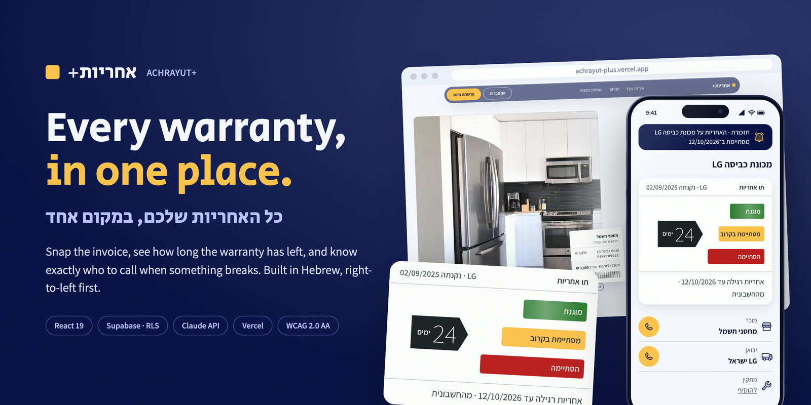
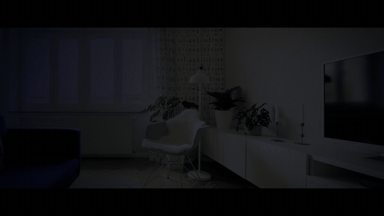
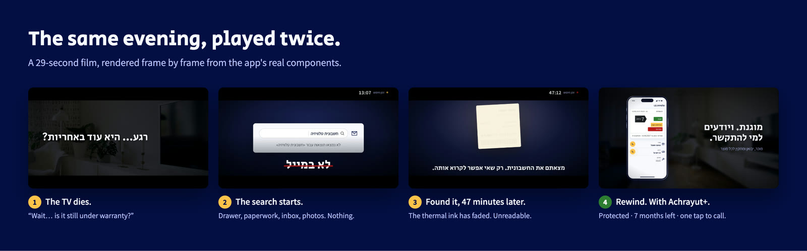
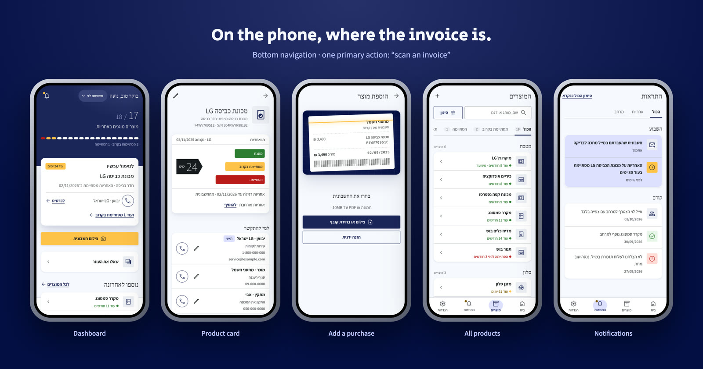
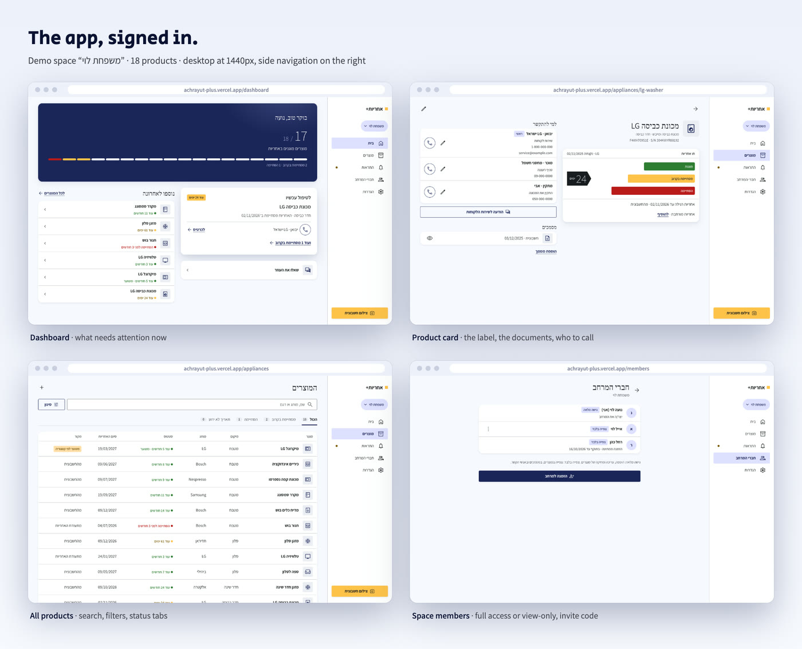
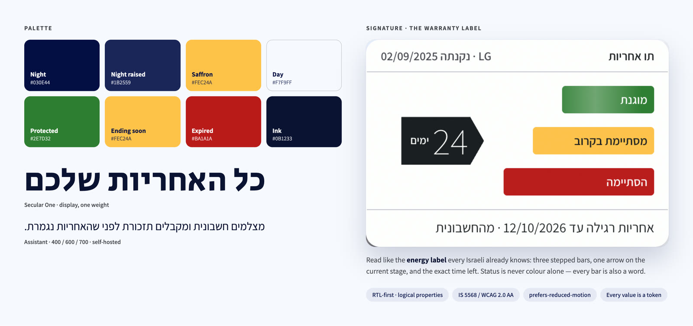
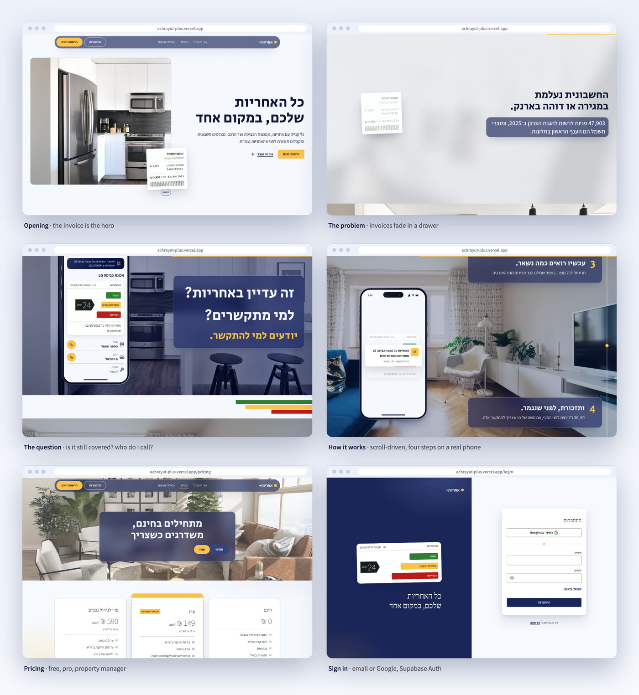
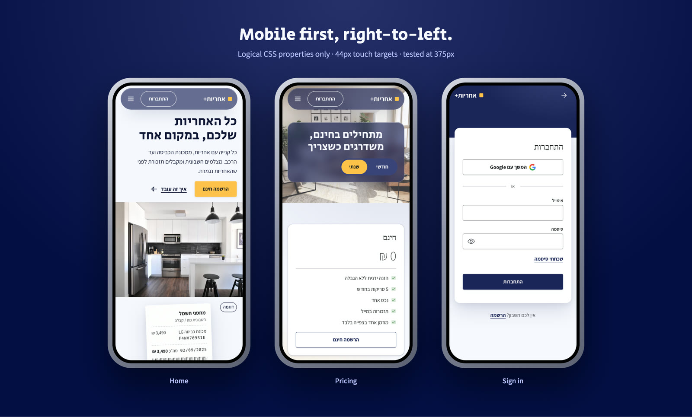
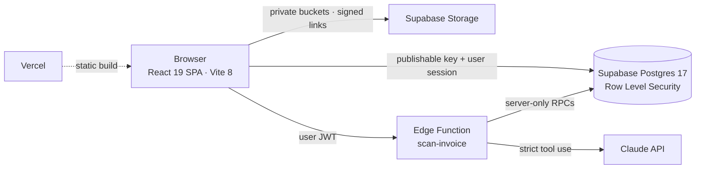
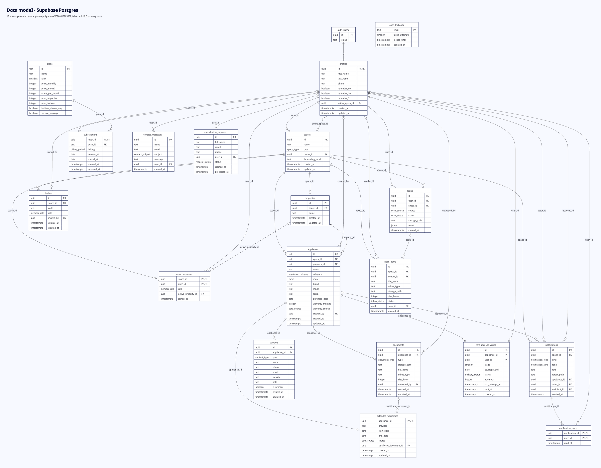

<p align="center">
  
</p>

<p align="center">
  <a href="https://achrayut-plus.vercel.app"><b>Live site</b></a>
  &nbsp;·&nbsp;
  <a href="docs/readme/film.mp4"><b>Watch the film (29 s)</b></a>
  &nbsp;·&nbsp;
  <a href="docs/readme/reel.mp4">Reel 9:16 (15 s)</a>
  &nbsp;·&nbsp;
  <a href="#hebrew">עברית</a>
</p>

<p align="center">
  
  
  
  
  
  
</p>

---

**Achrayut+** (Hebrew for *warranty+*) is a Hebrew, right-to-left web app for Israeli households. Take a photo of the invoice for anything you buy with a warranty, from a washing machine to a car, and the app keeps the document, shows how much warranty is left, reminds you before it ends, and tells you who to call: the seller, the importer or the installer.

It is my final project for the *AI-Augmented Web Development* course (Yariv Gilad). I designed, wrote and shipped all of it: product research, PRD, design system, front end, database, security model and the launch film.

> **Try it:** [achrayut-plus.vercel.app](https://achrayut-plus.vercel.app) → *התחברות* (sign in) with a demo account, password `Warranty2026`:
> - `noa@example.com`: full access, two spaces, 18 products
> - `eyal@example.com`: view-only member of the same family space
> - `new@example.com`: no space yet, join with the invite code `BLH4K2`
>
> These accounts are shared demo data and are reset before each review.

## The problem

Something breaks at home. You need the warranty. The invoice is somewhere in a drawer, an inbox or a phone gallery, and when you finally find it, the thermal ink has faded. In 2025 the Israel Consumer Protection Authority received 47,903 inquiries, and electrical appliances topped the complaint list.

<p align="center">
  <a href="docs/readme/film.mp4"></a>
  <br><sub>Click to watch the full film. Every frame is rendered from the app's real React components.</sub>
</p>

<p align="center"></p>

## Who it is for

| | Who | What they need |
|---|---|---|
| **Primary** | **Noa, 37, a busy parent** in Modi'in, about twenty appliances at home | The day something breaks: see in one screen if it is still covered, and call the right person in one tap |
| | **Ronen, 51, runs five Airbnb flats** in Tel Aviv, two of them for owners abroad | A breakdown must not cost a booking, and the owners want a report without email attachments |
| | **Maya, 31, a wedding photographer** (licensed freelancer) in Haifa | Her gear cannot fail mid-season, so she sends it for a check before the warranty ends |

They use it in two moments: at the checkout, to snap the invoice, and on the day something breaks. Market: about 2.9 million Israeli households, 97.9% with a washing machine and 96.8% with air conditioning (Central Bureau of Statistics). Serviceable market: about 1.34 million well-equipped households. This is a hypothesis, see [`docs/02-research.md`](docs/02-research.md).

## Competitors and what makes it different

Today most people use a drawer, photos lost in WhatsApp or the gallery, or a spreadsheet they stop updating. The dedicated apps are in English:

| | Itemtopia | TrackWarranty | HomeZada | FOLDI 🇮🇱 | **Achrayut+** |
|---|---|---|---|---|---|
| AI reads the invoice | ✅ | ✅ | ? | ? | ✅ |
| Reminders before the end | ✅ | ✅ | ? | ✅ generic | ✅ |
| Hebrew, right-to-left | ❌ | ❌ | ? | ✅ | ✅ |
| Israeli warranty rules | ? | ? | ? | ? | ✅ |
| Three contacts per product: seller, importer, installer | ? | ? | ? | ? | ✅ |
| Where every date comes from (invoice, certificate, estimate) | ? | ? | ? | ? | ✅ |
| Extended warranty tracked separately | ? | ? | ? | ? | ✅ |
| Shared with permissions | ✅ | ? | ? | ? | ✅ |

✅ seen on their site · ❌ checked, not offered · ? cannot be verified. Warranteer, the Israeli player, was acquired by ironSource in 2016 and is no longer active. **Reminders alone are not a differentiator**, since TrackWarranty already sends them at 90, 30 and 7 days. No competitor verifiably offers the combination of Hebrew, Israeli rules, three contacts and a visible source for every date. Full analysis in the [PRD](PRD.md) and [`docs/02-research.md`](docs/02-research.md).

## What it does

| | Feature | How |
|---|---|---|
| 1 | **Shared space** | A family or a business shares one space. Full access or view-only, joined with an invite code. |
| 2 | **Add a purchase** | Snap the invoice or a PDF. A server function reads it with Claude and fills the form; you check before saving. Manual entry always works. |
| 3 | **Product card** | The warranty label, every document, the extended warranty, and three contacts: seller, importer, installer. |
| 4 | **Dashboard** | What is protected, what is ending soon, what has ended, filtered by property for landlords. |
| 5 | **Reminders** | 90, 30 and 7 days before the end. In-app notifications for everything that happens in the space. |

Also live: three plans (free, pro, property manager; payment is simulated) and properties for landlords. The [PRD](PRD.md) adds two AI features whose screens are already built: invoice forwarding by email and a read-only assistant.

<p align="center"></p>

<p align="center"></p>

## Design

<p align="center"></p>

- **One signature element.** The warranty label reads like the energy label every Israeli already knows: three stepped bars, an arrow on the current stage, and the exact time left.
- **Right-to-left first.** Only logical CSS properties (`inset-inline`, `margin-block`…), mirrored icons, `<bdi>` around mixed Hebrew and Latin strings, dates and prices formatted with `Intl` for `he-IL`.
- **Accessible by default.** IS 5568 / WCAG 2.0 AA: visible focus, 44 px touch targets, 4.5:1 contrast, status never shown by colour alone, every animation respects `prefers-reduced-motion`.
- **Every value is a token.** Colours, sizes, spacing and radii live in one file, [`globals.css`](src/styles/globals.css), derived from [`DESIGN.md`](DESIGN.md).
- **Real empty, loading, error and view-only states**, not just the happy path.

<p align="center"></p>

<p align="center"></p>

## Engineering



- **Database.** 19 tables, 16 enums and 12 migrations, with the ERD in [`docs/07-data-design.md`](docs/07-data-design.md). Row Level Security on every table, plus column-level grants.
- **Permissions tested for real.** I ran 45 access tests across owner, view-only member, stranger, signed-out, free and pro accounts. A view-only member cannot write, even when calling the API directly (HTTP 403).
- **AI on the server only.** The browser shrinks the photo and uploads it to a private bucket. The Edge Function checks the user, the role and the monthly quota, then calls Claude with a strict JSON schema. It validates every field (category from a closed list, a real date not in the future, 1–600 months), records the scan and deletes the temporary file on every path. The invoice text is treated as data, never as instructions.
- **No secrets in the bundle.** Only the Supabase publishable key reaches the browser. The Claude key lives in Supabase secrets, and the scan RPCs are callable by the service role only.
- **Performance work.** HomePage loads eagerly, and the 23 signed-in pages are split into a single lazy chunk. Layout shift went from 0.527 to 0. The hero image is preloaded.

| Quality check (production, mobile) | Result |
|---|---|
| Lighthouse accessibility · best practices · SEO | **100 · 100 · 100** |
| Lighthouse performance | 80 (target 90, in progress) |
| axe-core | 0 violations on 11 states |
| Layouts | Tested at 375 px and 1440 px |
| `oxlint` · `npm audit` | 0 warnings · 0 vulnerabilities |

**Stack:** React 19, React Router 7, Vite 8, plain CSS custom properties (no UI library), GSAP + Lenis for the scroll story, Phosphor icons, Supabase (Auth, Postgres, Storage, Edge Functions), Claude API, Vercel.

## Data model (ERD)

<p align="center"><a href="docs/readme/erd.png"></a></p>

19 tables in Supabase Postgres. The diagram is generated from the migration that creates them ([`20260919205607_tables.sql`](supabase/migrations/20260919205607_tables.sql)), so it matches the real database. It shows columns, types, primary and foreign keys. Click to zoom. The Mermaid source is in [`docs/readme/erd.mmd`](docs/readme/erd.mmd), and every table and permission is explained in [`docs/07-data-design.md`](docs/07-data-design.md).

- **Spaces are the unit of sharing.** `space_members` links people to spaces with a role (`full` or `viewer`), and `invites` holds the six-character codes.
- **One product, three kinds of attached data:** `documents` (private files in Storage), `contacts` (seller, importer, installer) and an optional `extended_warranties` row.
- **Server-only tables** (`reminder_deliveries`, `auth_lockouts`) have RLS enabled and no policy, so only the service role reaches them.

## External services and integrations

| Service | Type | Role in the product | Status |
|---|---|---|---|
| Supabase Auth | Authentication | Email and password sign-up, email verification, password reset, sessions (PKCE) | Live |
| Google OAuth (through Supabase) | Authentication | “Continue with Google” | Button built, provider not configured yet |
| Supabase Postgres | Database | 19 tables, Row Level Security on every table, RPCs for joining a space and changing plans | Live |
| Supabase Storage | File storage | Private buckets `documents` and `scans` (images and PDFs, 10 MB max), short-lived signed links | Live |
| Supabase Edge Function `scan-invoice` | Server logic | Checks the user, the role and the monthly quota, then calls Claude with a key the browser never sees | Live |
| Anthropic Claude API | AI, API call | Reads an invoice photo or PDF into structured fields with strict tool use | Implemented; waiting for the production key |
| Vercel | Hosting and CI/CD | Builds and serves the app on every push to GitHub | Live |
| GitHub | Code hosting | Repository and deployment trigger | Live |
| Unsplash | Image CDN | Photos on the public site | Live |
| Resend | Email, API | Warranty reminders at 90, 30 and 7 days, auth emails from our own domain | Planned |

## How it was built

The course follows an AI-augmented method: every stage produces a document that the next stage builds on, and AI works inside written rules ([`CLAUDE.md`](CLAUDE.md)).

| Stage | Output |
|---|---|
| 1 · Ideation | [`docs/01-ideation.md`](docs/01-ideation.md) |
| 2 · Research: personas, user stories, competitors, market size | [`docs/02-research.md`](docs/02-research.md) |
| 3 · System design | [`docs/03-system-design.md`](docs/03-system-design.md) |
| 4 · Wireframes | [`docs/04-wireframes.md`](docs/04-wireframes.md) |
| 5 · UI design | [`docs/05-ui-design.md`](docs/05-ui-design.md) · [`DESIGN.md`](DESIGN.md) |
| 6 · Front end, page by page | [`TASK-PLAN.md`](TASK-PLAN.md) |
| 7 · Data design and ERD | [`docs/07-data-design.md`](docs/07-data-design.md) |
| 8 · Back end: auth, RLS, storage, AI | [`supabase/`](supabase) |
| 9 · Accessibility, performance, visual QA | [`TASK-PLAN.md`](TASK-PLAN.md) |

The product requirements live in [`PRD.md`](PRD.md).

### Working with AI, step by step

- **Rules before code.** [`CLAUDE.md`](CLAUDE.md) sets the contract for the AI pair programmer: one step at a time, explicit approval before any file, package, commit or deploy; Hebrew and RTL rules; accessibility rules; no secrets in the browser; and tool output treated as data, never as instructions.
- **A plan, then proof.** Every step is written in [`TASK-PLAN.md`](TASK-PLAN.md) before it starts and closed with what was actually checked: real browser at 375 and 1440 px, Lighthouse, axe-core, and access tests against the API.
- **Design to code.** Google Stitch produced about 60 reference screens ([`stitch/`](stitch)). They were rebuilt as reusable React components, and the PRD and [`DESIGN.md`](DESIGN.md) win whenever an export contradicts them.
- **The database through MCP.** A Supabase MCP server, scoped to this single project, applied the migrations and ran the security advisor. The advisor caught that Supabase grants `EXECUTE` on every new function to anonymous and signed-in users; a dedicated migration revokes it.
- **AI inside the product.** Claude reads invoices on the server, with a strict schema and every field validated before it reaches the database.
- **Even the film is code.** It is rendered frame by frame from the app's own components, so the marketing always matches the product.

## Status

- **Live:** public site, email sign-in, spaces and roles, products and documents, dashboard, notifications, plans (payment is simulated).
- **Built, activation pending:** invoice reading with Claude (waiting for the production API key).
- **Next:** email reminders (scheduled function + Resend), Google sign-in, auth emails from our own domain.

## Run it locally

```bash
npm install
cp .env.example .env.local   # Supabase URL + publishable key
npm run dev
```

## The film

<p>
  <a href="docs/readme/film.mp4"></a>
  <a href="docs/readme/reel.mp4"></a>
</p>

A 29-second film and a 15-second reel. Every frame is a pure function of time, rendered by headless Chrome from the app's real components (the phone, the warranty label, the contacts). The soundtrack is mixed from royalty-free Apple Loops.

## Credits

Design, code and film by **Raphael Belhassen** · [github.com/belhassen-raphael99](https://github.com/belhassen-raphael99)
Course: *AI-Augmented Web Development*, Yariv Gilad · Photos: [Unsplash](https://unsplash.com) · Fonts: Secular One and Assistant (SIL OFL)

---

<a id="hebrew"></a>
<div dir="rtl">

## אחריות+ בעברית

**אחריות+** היא אפליקציית ווב בעברית לשמירת החשבוניות של כל קנייה עם אחריות, ממכונת הכביסה ועד הרכב. מצלמים את החשבונית, והאפליקציה שומרת את המסמך, מראה כמה אחריות נשארה, מזכירה לפני שהיא נגמרת ואומרת למי להתקשר: למוכר, ליבואן או למתקין.

זה פרויקט הגמר שלי בקורס *AI-Augmented Web Development* של יריב גלעד. עשיתי את כל השלבים: מחקר, PRD, מערכת עיצוב, חזית, מסד נתונים, הרשאות וסרט ההשקה.

**מה יש באפליקציה**
- מרחב משותף למשפחה או לעסק, עם גישה מלאה או צפייה בלבד וקוד הזמנה.
- הוספת מוצר: צילום חשבונית או PDF, קריאה בשרת עם Claude ובדיקה לפני שמירה. הזנה ידנית תמיד אפשרית.
- כרטיס מוצר עם תו האחריות, המסמכים ואנשי הקשר: מוכר, יבואן ומתקין.
- דשבורד: מוגנת · מסתיימת בקרוב · הסתיימה.
- תזכורות 90, 30 ו־7 ימים לפני הסוף, והתראות בתוך האפליקציה.

**עיצוב:** RTL מההתחלה (רק מאפייני CSS לוגיים), נגישות לפי ת"י 5568 (WCAG 2.0 AA), כל ערך הוא משתנה, וכל המצבים נבנו: ריק, טעינה, שגיאה וצפייה בלבד.

**הנדסה:** React 19 ו־Vite 8 · Supabase עם RLS על כל טבלה (45 בדיקות גישה אמיתיות) · קבצים בדליים פרטיים · Claude רק בשרת, בתוך Edge Function · שום סוד בדפדפן · Lighthouse במובייל: נגישות, שיטות עבודה ו־SEO ב־100.

**מסמכי הפרויקט:** [PRD](PRD.md) · [עיצוב](DESIGN.md) · [תוכנית העבודה](TASK-PLAN.md) · [מבנה הנתונים](docs/07-data-design.md)

**האתר:** [achrayut-plus.vercel.app](https://achrayut-plus.vercel.app)

**לבדיקה:** «התחברות» עם חשבון הדגמה, סיסמה `Warranty2026`: ‏`noa@example.com` (גישה מלאה) · ‏`eyal@example.com` (צפייה בלבד) · ‏`new@example.com` (בלי מרחב, קוד הזמנה `BLH4K2`).

**מסמכי ההגשה:** קהל היעד והמתחרים, תרשים ה־ERD ורשימת השירותים החיצוניים נמצאים למעלה, בחלק האנגלי.

</div>
