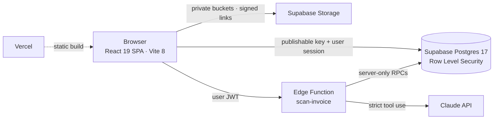

<p align="center">
  
</p>

<p align="center">
  <a href="https://achrayut-plus.vercel.app"><b>Live site</b></a>
  &nbsp;·&nbsp;
  <a href="docs/readme/film.mp4"><b>Watch the film (29 s)</b></a>
  &nbsp;·&nbsp;
  <a href="docs/readme/reel.mp4">Reel 9:16 (15 s)</a>
  &nbsp;·&nbsp;
  <a href="#hebrew">עברית</a>
</p>

<p align="center">
  
  
  
  
  
  
</p>

---

**Achrayut+** (Hebrew for *warranty+*) is a Hebrew, right-to-left web app for Israeli households. Take a photo of the invoice for anything you buy with a warranty, from a washing machine to a car, and the app keeps the document, shows how much warranty is left, reminds you before it ends, and tells you who to call: the seller, the importer or the installer.

It is my final project for the *AI-Augmented Web Development* course (Yariv Gilad). I designed, wrote and shipped all of it: product research, PRD, design system, front end, database, security model and the launch film.

## The problem

Something breaks at home. You need the warranty. The invoice is somewhere in a drawer, an inbox or a phone gallery, and when you finally find it, the thermal ink has faded. In 2025 the Israel Consumer Protection Authority received 47,903 inquiries, and electrical appliances topped the complaint list.

<p align="center">
  <a href="docs/readme/film.mp4"></a>
  <br><sub>Click to watch the full film. Every frame is rendered from the app's real React components.</sub>
</p>

<p align="center"></p>

## What it does

| | Feature | How |
|---|---|---|
| 1 | **Shared space** | A family or a business shares one space. Full access or view-only, joined with an invite code. |
| 2 | **Add a purchase** | Snap the invoice or a PDF. A server function reads it with Claude and fills the form; you check before saving. Manual entry always works. |
| 3 | **Product card** | The warranty label, every document, the extended warranty, and three contacts: seller, importer, installer. |
| 4 | **Dashboard** | What is protected, what is ending soon, what has ended, filtered by property for landlords. |
| 5 | **Reminders** | 90, 30 and 7 days before the end. In-app notifications for everything that happens in the space. |

Also live: three plans (free, pro, property manager; payment is simulated) and properties for landlords. The [PRD](PRD.md) adds two AI features whose screens are already built: invoice forwarding by email and a read-only assistant.

## Design

<p align="center"></p>

- **One signature element.** The warranty label reads like the energy label every Israeli already knows: three stepped bars, an arrow on the current stage, and the exact time left.
- **Right-to-left first.** Only logical CSS properties (`inset-inline`, `margin-block`…), mirrored icons, `<bdi>` around mixed Hebrew and Latin strings, dates and prices formatted with `Intl` for `he-IL`.
- **Accessible by default.** IS 5568 / WCAG 2.0 AA: visible focus, 44 px touch targets, 4.5:1 contrast, status never shown by colour alone, every animation respects `prefers-reduced-motion`.
- **Every value is a token.** Colours, sizes, spacing and radii live in one file, [`globals.css`](src/styles/globals.css), derived from [`DESIGN.md`](DESIGN.md).
- **Real empty, loading, error and view-only states**, not just the happy path.

<p align="center"></p>

<p align="center"></p>

## Engineering



- **Database.** 19 tables, 16 enums and 12 migrations, with the ERD in [`docs/07-data-design.md`](docs/07-data-design.md). Row Level Security on every table, plus column-level grants.
- **Permissions tested for real.** I ran 45 access tests across owner, view-only member, stranger, signed-out, free and pro accounts. A view-only member cannot write, even when calling the API directly (HTTP 403).
- **AI on the server only.** The browser shrinks the photo and uploads it to a private bucket. The Edge Function checks the user, the role and the monthly quota, then calls Claude with a strict JSON schema. It validates every field (category from a closed list, a real date not in the future, 1–600 months), records the scan and deletes the temporary file on every path. The invoice text is treated as data, never as instructions.
- **No secrets in the bundle.** Only the Supabase publishable key reaches the browser. The Claude key lives in Supabase secrets, and the scan RPCs are callable by the service role only.
- **Performance work.** HomePage loads eagerly, and the 23 signed-in pages are split into a single lazy chunk. Layout shift went from 0.527 to 0. The hero image is preloaded.

| Quality check (production, mobile) | Result |
|---|---|
| Lighthouse accessibility · best practices · SEO | **100 · 100 · 100** |
| Lighthouse performance | 80 (target 90, in progress) |
| axe-core | 0 violations on 11 states |
| Layouts | Tested at 375 px and 1440 px |
| `oxlint` · `npm audit` | 0 warnings · 0 vulnerabilities |

**Stack:** React 19, React Router 7, Vite 8, plain CSS custom properties (no UI library), GSAP + Lenis for the scroll story, Phosphor icons, Supabase (Auth, Postgres, Storage, Edge Functions), Claude API, Vercel.

## How it was built

The course follows an AI-augmented method: every stage produces a document that the next stage builds on, and AI works inside written rules ([`CLAUDE.md`](CLAUDE.md)).

| Stage | Output |
|---|---|
| 1 · Ideation | [`docs/01-ideation.md`](docs/01-ideation.md) |
| 2 · Research: personas, user stories, competitors, market size | [`docs/02-research.md`](docs/02-research.md) |
| 3 · System design | [`docs/03-system-design.md`](docs/03-system-design.md) |
| 4 · Wireframes | [`docs/04-wireframes.md`](docs/04-wireframes.md) |
| 5 · UI design | [`docs/05-ui-design.md`](docs/05-ui-design.md) · [`DESIGN.md`](DESIGN.md) |
| 6 · Front end, page by page | [`TASK-PLAN.md`](TASK-PLAN.md) |
| 7 · Data design and ERD | [`docs/07-data-design.md`](docs/07-data-design.md) |
| 8 · Back end: auth, RLS, storage, AI | [`supabase/`](supabase) |
| 9 · Accessibility, performance, visual QA | [`TASK-PLAN.md`](TASK-PLAN.md) |

The product requirements live in [`PRD.md`](PRD.md).

## Status

- **Live:** public site, email sign-in, spaces and roles, products and documents, dashboard, notifications, plans (payment is simulated).
- **Built, activation pending:** invoice reading with Claude (waiting for the production API key).
- **Next:** email reminders (scheduled function + Resend), Google sign-in, auth emails from our own domain.

## Run it locally

```bash
npm install
cp .env.example .env.local   # Supabase URL + publishable key
npm run dev
```

## The film

<p>
  <a href="docs/readme/film.mp4"></a>
  <a href="docs/readme/reel.mp4"></a>
</p>

A 29-second film and a 15-second reel. Every frame is a pure function of time, rendered by headless Chrome from the app's real components (the phone, the warranty label, the contacts). The soundtrack is mixed from royalty-free Apple Loops.

## Credits

Design, code and film by **Raphael Belhassen** · [github.com/belhassen-raphael99](https://github.com/belhassen-raphael99)
Course: *AI-Augmented Web Development*, Yariv Gilad · Photos: [Unsplash](https://unsplash.com) · Fonts: Secular One and Assistant (SIL OFL)

---

<a id="hebrew"></a>
<div dir="rtl">

## אחריות+ בעברית

**אחריות+** היא אפליקציית ווב בעברית לשמירת החשבוניות של כל קנייה עם אחריות, ממכונת הכביסה ועד הרכב. מצלמים את החשבונית, והאפליקציה שומרת את המסמך, מראה כמה אחריות נשארה, מזכירה לפני שהיא נגמרת ואומרת למי להתקשר: למוכר, ליבואן או למתקין.

זה פרויקט הגמר שלי בקורס *AI-Augmented Web Development* של יריב גלעד. עשיתי את כל השלבים: מחקר, PRD, מערכת עיצוב, חזית, מסד נתונים, הרשאות וסרט ההשקה.

**מה יש באפליקציה**
- מרחב משותף למשפחה או לעסק, עם גישה מלאה או צפייה בלבד וקוד הזמנה.
- הוספת מוצר: צילום חשבונית או PDF, קריאה בשרת עם Claude ובדיקה לפני שמירה. הזנה ידנית תמיד אפשרית.
- כרטיס מוצר עם תו האחריות, המסמכים ואנשי הקשר: מוכר, יבואן ומתקין.
- דשבורד: מוגנת · מסתיימת בקרוב · הסתיימה.
- תזכורות 90, 30 ו־7 ימים לפני הסוף, והתראות בתוך האפליקציה.

**עיצוב:** RTL מההתחלה (רק מאפייני CSS לוגיים), נגישות לפי ת"י 5568 (WCAG 2.0 AA), כל ערך הוא משתנה, וכל המצבים נבנו: ריק, טעינה, שגיאה וצפייה בלבד.

**הנדסה:** React 19 ו־Vite 8 · Supabase עם RLS על כל טבלה (45 בדיקות גישה אמיתיות) · קבצים בדליים פרטיים · Claude רק בשרת, בתוך Edge Function · שום סוד בדפדפן · Lighthouse במובייל: נגישות, שיטות עבודה ו־SEO ב־100.

**מסמכי הפרויקט:** [PRD](PRD.md) · [עיצוב](DESIGN.md) · [תוכנית העבודה](TASK-PLAN.md) · [מבנה הנתונים](docs/07-data-design.md)

**האתר:** [achrayut-plus.vercel.app](https://achrayut-plus.vercel.app)

</div>
