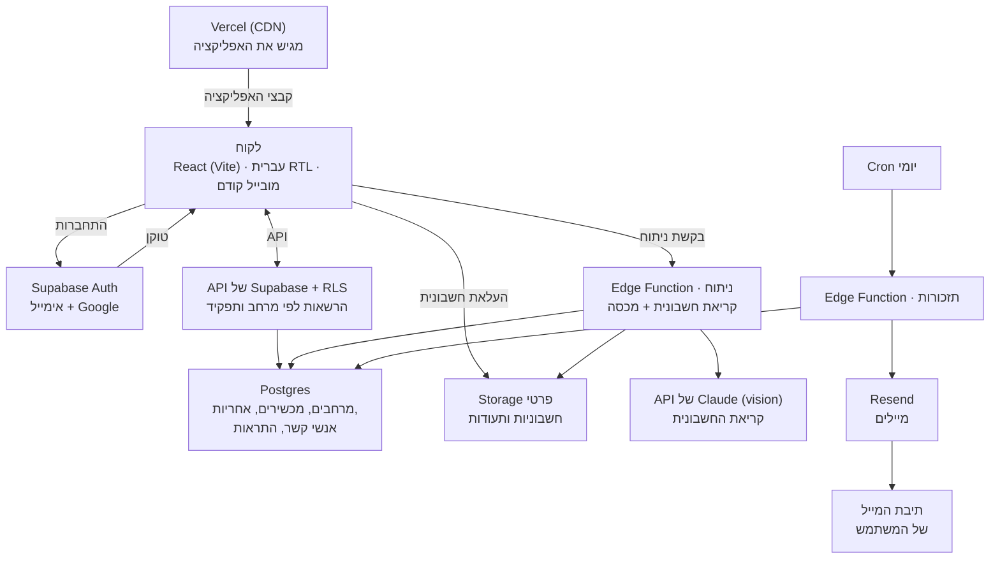
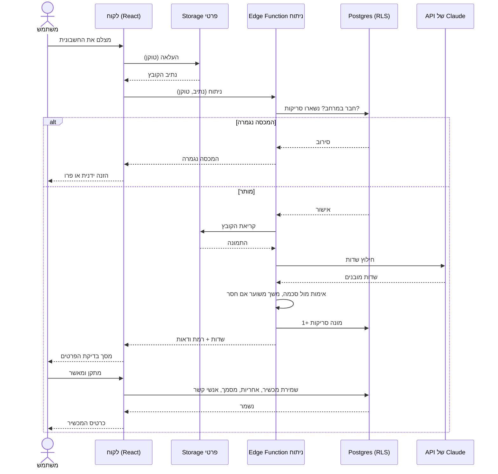
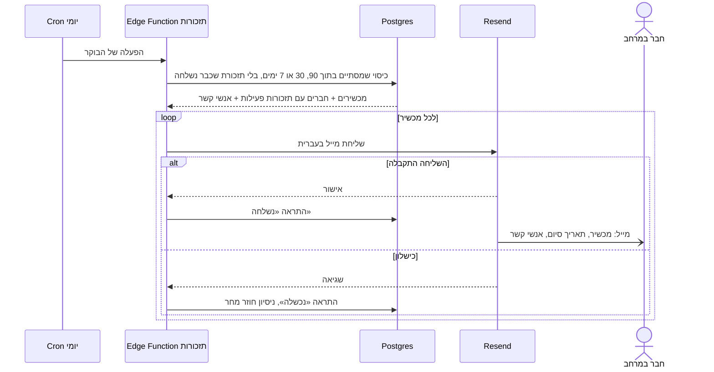

# שלב 3 — System Design

**אושר:** 14/09/2026 · **עודכן:** 15/09/2026 (החלטות ה־PRD, סעיף C)

---

## A. ארכיטקטורה

### תפקיד כל רכיב

| רכיב | תפקיד באפליקציה |
|---|---|
| **Client** (React) | מציג את המסכים בעברית, מצלם, שולח פעולות. **לא מחליט דבר**: לא מכסה, לא הרשאות, לא מפתח בינה מלאכותית |
| **Authentication** (Supabase Auth) | הרשמה באימייל או Google, שכחתי סיסמה, טוקן סשן |
| **Server** (API של Supabase + RLS) | אוכף את הכללים: מי רואה איזה מרחב, מי רשאי לשנות לפי התפקיד |
| **Database** (Postgres) | מרחבים, חברים, מכשירים, אחריות, אנשי קשר, הפניות למסמכים, התראות |
| **File Storage** (Supabase, פרטי) | החשבוניות והתעודות. גישה רק דרך קישור זמני, רק לחברי המרחב |
| **CDN** (Vercel) | מגיש את האפליקציה. החשבוניות הפרטיות **לעולם לא** עוברות ב־CDN ציבורי |
| **שירות חיצוני: בינה מלאכותית** (API של Claude) | קורא את החשבונית ומחזיר שדות מובנים. נקרא רק מתוך ה־Edge Function: המפתח נשאר בשרת |
| **שירות חיצוני: מייל** (Resend) | שולח תזכורות ומיילים של החשבון |
| **Scheduler** (Cron של Supabase) | כל יום מחפש אחריות שמגיעה ל־90, 30 ו־7 ימים ומפעיל את המיילים |
| **Notifications** | מייל, ומרכז ההתראות באפליקציה |

### מה לא בשימוש, ולמה (הכלל השלישי של יריב)
- **זמן אמת**: הנתונים משתנים לעיתים רחוקות; רענון מספיק.
- **Job Queue**: הקריאה לוקחת כמה שניות; מסך «קוראים את החשבונית» מספיק ב־V1.
- **Webhooks**: אין תשלום אמיתי.
- **Cache**: הנפחים קטנים מדי.
- **Load balancer**: Vercel ו־Supabase מטפלים בזה.

**«Never trust the client»:** המקבילה אצלנו היא מכסת 5 הסריקות בחינם. אם הדפדפן סופר, כל אחד עוקף אותה בשניות וצורך בינה מלאכותית על חשבוננו. לכן המכסה נבדקת ב־Edge Function, רגע לפני הקריאה ל־Claude.

---

## B. מסלולים ותרשימי רצף

### מסלול 1 — הוספת מכשיר מצילום חשבונית

1. **העלאה**: הלקוח מעלה את התמונה ל־Storage הפרטי. גם ה־Storage אוכף הרשאות: חבר בצפייה בלבד לא יכול להעלות.
2. **בקשת ניתוח**: הלקוח קורא ל־Edge Function עם נתיב הקובץ והטוקן.
3. **בדיקות בשרת**: הטוקן, החברות במרחב והמכסה. אם המכסה נגמרה — סירוב, והלקוח מציע הזנה ידנית או פרו.
4. **קריאה**: הקובץ נשלח ל־Claude, שמחזיר שדות מובנים.
5. **אימות**: השדות נבדקים מול סכמה. אם משך האחריות חסר — 12 חודשים, מסומן «משוער». טקסט החשבונית הוא נתון, לעולם לא הוראה. מונה הסריקות עולה ב־1 **רק אם הקריאה הצליחה**.
6. **בדיקה**: המשתמש רואה את השדות, מתקן ומאשר. **שום דבר לא נשמר לפני האישור.**
7. **שמירה**: הלקוח כותב את המכשיר, האחריות עם מקור כל תאריך, המסמך ואנשי הקשר. ההרשאות מסננות כל כתיבה.

**כשמשהו משתבש** (הכלל הרביעי של יריב, «מה קורה כש…»):
- **חשבונית לא קריאה** או **בינה מלאכותית לא זמינה**: הודעה ברורה ומעבר להזנה ידנית, בלי לאבד את התמונה. הסריקה לא נספרת.
- **כמה מכשירים באותה חשבונית**: המשתמש בוחר אחד; את השאר אפשר להוסיף בלי סריקה נוספת.
- **קובץ כבד מדי**: נדחה בדפדפן, עוד לפני ההעלאה.

### מסלול 2 — תזכורת לפני סוף האחריות

1. כל בוקר ב־08:00 (שעון ישראל), ה־Cron מפעיל את ה־Edge Function של התזכורות.
2. היא מחפשת מכשירים שסוף הכיסוי שלהם בתוך 90, 30 או 7 ימים, **ושהתזכורת של המדרגה הזו עוד לא נשלחה**.
3. לכל אחד היא מוצאת את המכשיר, את החברים שהתזכורות שלהם פעילות ואת אנשי הקשר.
4. היא שולחת מייל בעברית דרך Resend: המכשיר, תאריך הסיום ולמי להתקשר.
5. היא רושמת התראה («נשלחה» או «נכשלה»), שמופיעה במרכז ההתראות. בכישלון — ניסיון חוזר למחרת.

**אידמפוטנטיות:** Cron יכול לרוץ פעמיים (למשל אחרי תקלה). בלי הבדיקה בשלב 2, המשפחה מקבלת את אותו מייל פעמיים ומתחילה להתעלם מכל התזכורות. לכן טבלת ההתראות היא גם זיכרון: **שורה אחת לכל מכשיר ולכל מדרגה** (90, 30, 7). גם אם הפעולה רצה כמה פעמים, נשלח מייל אחד.

---

## C. עדכונים אחרי ה־PRD (15/09/2026)

| נושא | ההחלטה | מקור |
|---|---|---|
| מכסה | רק קריאה מוצלחת נספרת; חשבונית לא קריאה ושירות לא זמין לא נספרים | FR-2.3 |
| זמן קריאה | הקריאה נקטעת אחרי 30 שניות | FR-2.4, NFR-5 |
| משך משוער | 12 חודשים לכל הקטגוריות ב־V1 | FR-2.9 |
| קבצים שלא נשמרו | נמחקים אחרי 24 שעות | NFR-7 |
| קישור זמני למסמך | תקף 5 דקות | NFR-7 |
| איש קשר | המוכר שנקרא מהחשבונית נוצר אוטומטית | FR-3.5 |
| תזכורות ואחריות מורחבת | לפי סוף הכיסוי בלבד (סוף המורחבת אם יש), לא לפי סוף האחריות הרגילה | FR-5.1 |
| מכשיר שנוסף באיחור | נשלחת רק המדרגה הקרובה, עם מספר הימים האמיתי | FR-5.1 |
| נמענים | כל חברי המרחב, כולל צפייה בלבד; שלושת המתגים פעילים כברירת מחדל | FR-5.2 |
