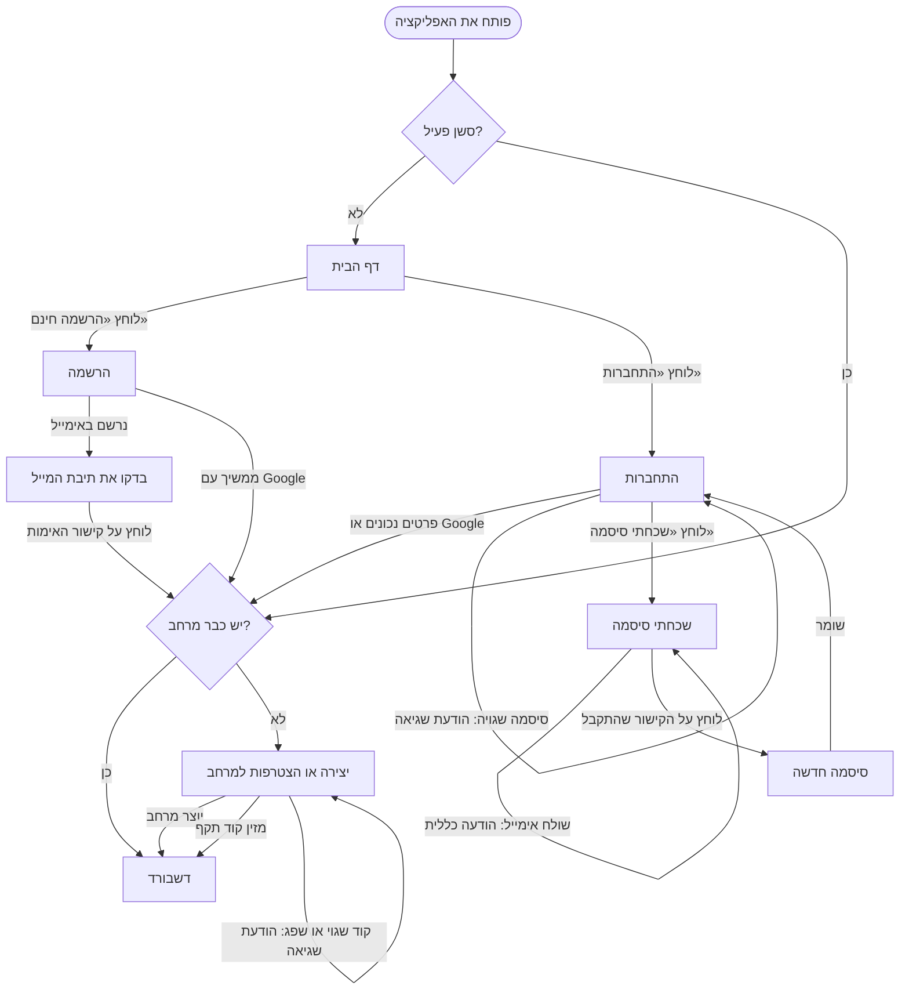
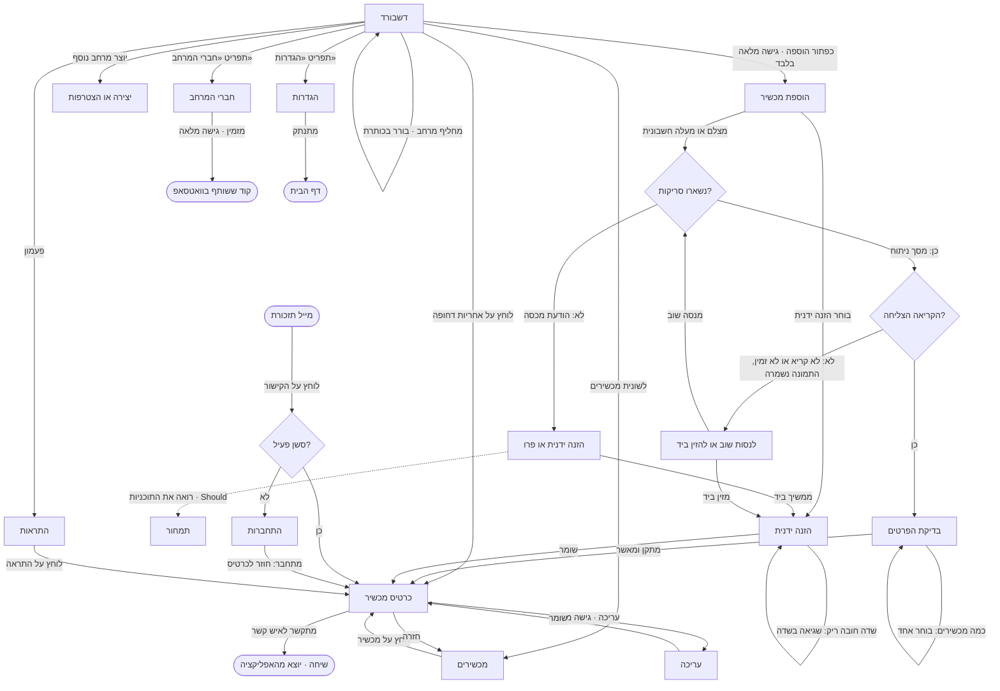

# שלב 4 — Wireframe

**אושר:** 14/09/2026 · **נוסף:** 15/09/2026 (דף הבית, התחברות, הרשמה; דשבורד v3 וכרטיס v2 אחרי שלב 5)

---

## A. מפת האתר

```text
אחריות+
│
├── ציבורי (בלי התחברות)
│   ├── דף הבית                        /
│   ├── התחברות                        /login
│   ├── הרשמה                          /signup
│   ├── בדקו את תיבת המייל             /check-email          ← נוסף (נחשף ב־flow)
│   ├── שכחתי סיסמה                    /forgot-password
│   ├── סיסמה חדשה                     /reset-password
│   ├── אימות האימייל (מהקישור)        /verify-email         ← נוסף בבנייה (A10, A11)
│   └── חשבון מושבת                    /account-disabled     ← נוסף בבנייה (A19)
│
├── מחובר · כניסה ראשונה
│   └── יצירה או הצטרפות למרחב         /onboarding
│         ├── יצירה: סוג (משפחה ובית / עסק או כמה דירות) ושם   /onboarding/create
│         ├── הצטרפות: הקוד שהתקבל                              /onboarding/join
│         └── «הצטרפתם למרחב»                                   /onboarding/joined   ← נוסף בבנייה (O5)
│
├── מחובר · אפליקציה
│   ├── בורר מרחבים בכותרת, עם «יצירת מרחב נוסף»       ← נוסף (חובה ל־US8)
│   ├── דשבורד                         /dashboard                  M4
│   ├── מכשירים                        /appliances                 M4
│   │     לשוניות: הכול · מסתיימת בקרוב · הסתיימה · תאריך לא ידוע
│   ├── הוספת מכשיר                    /appliances/new             M2
│   │   ├── צילום או PDF → ניתוח → בדיקה   /appliances/new/scan
│   │   └── הזנה ידנית                  /appliances/new/manual
│   ├── כרטיס מכשיר                    /appliances/:id             M3
│   │   └── עריכה                       /appliances/:id/edit        M3
│   ├── התראות                         /notifications              M5
│   ├── חברי המרחב                     /members                    M1
│   └── הגדרות                         /settings
│         פרופיל · סיסמה · תזכורות · הגדרות המרחב · התנתקות · מחיקת חשבון
│
├── Should (מתוכנן, לא ב־V1)
│   תמחור /pricing · שאלות נפוצות /faq · יצירת קשר /contact · תנאי שימוש /terms ·
│   מדיניות פרטיות /privacy · הצהרת נגישות /accessibility · ביטול מנוי /cancel-subscription ·
│   התוכנית שלי · נכסים · עוזר בינה מלאכותית
│
└── אדמין: אין עמודים ב־V1
```

**שלוש החלטות:**
1. **אין עמוד «אחריות» נפרד**: הוא הפך ללשוניות בעמוד המכשירים (המודל «Tabs» מהשיעור).
2. **אין עמוד «מסמכים» כללי**: המסמכים נמצאים בכרטיס של כל מכשיר (M3).
3. **אין אדמין ב־V1**: כתוב במפורש «אין», כמו שיריב מבקש לסמן.

**הערת ניתוב:** `/appliances/new` חייב להיות מוגדר לפני `/appliances/:id`, אחרת הנתב יקרא «new» כמזהה מכשיר.

### מה משנה התפקיד «צפייה בלבד»

| עמוד | גישה מלאה | צפייה בלבד |
|---|---|---|
| הוספת מכשיר, עריכה | ✅ | ❌ העמוד מוסתר, הכפתור לא מוצג |
| כרטיס מכשיר | צפייה, עריכה, הוספת מסמך | צפייה והתקשרות לאנשי הקשר |
| חברי המרחב | צפייה והזמנה | צפייה בלבד |
| דשבורד, מכשירים, התראות | ✅ | ✅ |

---

## B. Navigation flow

**4 נקודות כניסה:** דף הבית (ביקור ראשון) · הדשבורד (סשן פתוח) · קישור ממייל תזכורת · קוד הזמנה שהגיע בוואטסאפ.

### Flow 1 — כניסה לאפליקציה



### Flow 2 — שימוש באפליקציה



**המסלול האידיאלי:** דף הבית ← הרשמה עם Google ← יצירת מרחב ← דשבורד ← הוספה ← צילום ← בדיקה ← כרטיס מכשיר.

**שני חורים שה־flow חשף במפת האתר:**
1. **העמוד «בדקו את תיבת המייל»** (`/check-email`): בלעדיו, מי שנרשם באימייל נופל לריק.
2. **בורר המרחבים** עם «יצירת מרחב נוסף»: בלעדיו **US8 בלתי אפשרי**, ורונן לא יכול ליצור מרחב לכל בעל דירה.

**התנהגות חשובה:** מי שלוחץ על קישור ממייל בלי להיות מחובר חוזר **לכרטיס הנכון** אחרי ההתחברות, לא לדשבורד.

---

## C. Wireframes

הקבצים נמצאים ב־`04-wireframes/` (נפתחים בדפדפן):

| קובץ | מה יש בו |
|---|---|
| `01-ecrans-cles-et-etats.html` | 1 דשבורד · 1b דשבורד ריק · 2 בדיקת הפרטים · 2b שגיאת ניתוח · 3 כרטיס מכשיר |
| `02-accueil-connexion-inscription.html` | 4 דף הבית · 5 התחברות · 6 הרשמה |
| `03-dashboard-v3-fiche-v2.html` | הדשבורד והכרטיס אחרי שלב 5: מספר גדול עם פס, ותו האחריות |

### הערות

**1 · דשבורד** (`/dashboard`)
- **נתונים**: מספר המכשירים, מה שמסתיים בתוך 90 יום, מה שנוסף לאחרונה — רק למרחב הפעיל.
- **שם המרחב ▾** פותח את בורר המרחבים, עם «יצירת מרחב נוסף».
- **שורה של אחריות שמסתיימת** פותחת את כרטיס המכשיר.
- **פעמון** ← התראות.
- **כפתור ההוספה** ← הוספת מכשיר. **לא מוצג בצפייה בלבד.**

**1b · דשבורד ריק**: מה שמשתמש חדש רואה — הזמנה להתחיל, לא מסך ריק. «צלמו חשבונית» פותח את הצילום, «הזנה ידנית» את הטופס. בצפייה בלבד, הכפתורים מוחלפים במשפט «אין עדיין מכשירים במרחב הזה».

**2 · בדיקת הפרטים** (`/appliances/new/scan`)
- **נתונים**: השדות שה־Edge Function החזירה, עם רמת ודאות.
- **תג «לבדוק»**: על שדות שהקריאה לא ודאית בהם.
- **תג «משוער לפי קטגוריה»**: המשך לא הופיע בחשבונית. זה הכלל «תמיד להציג את מקור התאריך».
- **שמירה** יוצרת את המכשיר ופותחת את הכרטיס. שום דבר לא נשמר לפני הלחיצה.

**2b · שגיאת ניתוח**: מצב השגיאה שיריב דורש. ההודעה אומרת מה קרה ומה עושים, בלי ז'רגון. התמונה נשמרת. «לנסות שוב» מריץ שוב, «הזנה ידנית» פותח את הטופס.

**3 · כרטיס מכשיר** (`/appliances/:id`)
- **נתונים**: המכשיר, שתי האחריות עם מקור כל תאריך, 3 אנשי הקשר והמסמכים.
- **אייקון טלפון** ← מחייג מיד.
- **עיפרון** ← עריכה. **לא מוצג בצפייה בלבד.**
- **עין על המסמך** ← פותחת את החשבונית דרך קישור זמני.

**4 · דף הבית** (`/`)
- **כפתור ראשי אחד: «הרשמה חינם»**, שמוביל להרשמה. «התחברות» בכותרת הוא כפתור משני. «איך זה עובד» גולל לאזור.
- **האזורים באים מהשלבים הקודמים**: 3 הצעדים = המסלול המרכזי · «למה אצלנו» = היתרונות מול המתחרים · «למי זה מתאים» = 3 הפרסונות · «מתחילים בחינם» = המודל.
- **גרסה למשתמש מחובר**: «לדשבורד» במקום «התחברות» ו«הרשמה».
- **חובה חוקית**: הקישור «ביטול מנוי» בכותרת התחתונה (סעיף 14ט), גם כשהתשלום מדומה.
- **במחשב (1440px)**: ה־hero בשתי עמודות (טקסט מימין, תמונה של בית אמיתי משמאל), הצעדים והיתרונות ב־3 עמודות.

**5 · התחברות** (`/login`)
- **Google ראשון**, כי זה הכי מהיר. שדה האימייל משמאל לימין; לסיסמה יש כפתור הצג/הסתר.
- **השגיאה מעורפלת בכוונה**: «האימייל או הסיסמה לא נכונים» לא חושפת אם האימייל קיים.
- **אחרי ההתחברות**: כניסה ראשונה אם אין מרחב, אחרת דשבורד, או הכרטיס שממנו הגיע אם לחץ על מייל.

**6 · הרשמה** (`/signup`)
- **Google או אימייל.** כלל הסיסמה (8 תווים לפחות) מוצג לפני כל שגיאה.
- **תיבת סימון חובה** לתנאי השימוש ולמדיניות הפרטיות.
- **«יצירת חשבון»** ← «בדקו את תיבת המייל». עם Google ← ישר לכניסה הראשונה.

**במחשב** (יריב מבקש לציין רק את ההבדלים): הסרגל התחתון הופך לסרגל צד מימין (RTL), הדשבורד בשתי עמודות, והכרטיס מציג את האחריות ואת אנשי הקשר זה לצד זה.

### עדכונים מאוחרים יותר (שלב 5 ו־PRD)

- **דשבורד v3**: במקום המונים — בלוק כחול לילה עם מספר גדול ופס מחולק, כרטיס «לטיפול עכשיו» שחופף את הבלוק, וכפתור «צילום חשבונית».
- **כרטיס v2**: תו האחריות (שלושה פסים וחץ) במקום רשימת האחריות.
- **החלטות ה־PRD שהקובץ `03` עוד לא מראה:** המספר הוא **17 / 18** (כולל «מסתיימת בקרוב»), האזור השני הוא **«נוספו לאחרונה»**, ובראש הכרטיס **אייקון קטגוריה** במקום תמונה.
