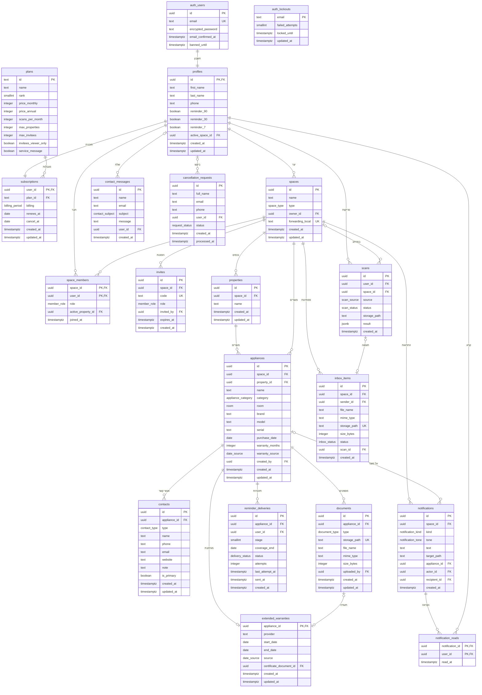

# שלב 7 — Data Design

**אושר:** 16/09/2026 (רפאל) · **מקור:** מסכי שלב 6, נתוני הדוגמה ב־`src/data/`, PRD §4–§7.
**עודכן:** 19/09/2026 — כל קנייה עם אחריות (PRD 1.1): 18 קטגוריות ו־10 מיקומים (§2), «מוצר» במקום «מכשיר».
השמות הטכניים לא השתנו: הטבלה נשארת `appliances` והעמודה `room`, כמו בקוד; בממשק הן «מוצר» ו«מיקום».
**לפי:** המודול «Data Design» של יריב גלעד — ישויות, תכונות, קשרים, מפתחות, CRUD, התחברות, קבצים, ERD.

> העיקרון של יריב: **החזית היא השרטוט.** כל נתון מזויף שמוצג במסך הוא עמודה שמסד הנתונים צריך לשמור.
> המסמך הזה הוא מה ששלב 8 בונה ב־Supabase (PostgreSQL).

---

## 0. איך נגזר — מסך אחרי מסך

| מסכים | מה מוצג במסך | ישויות |
|---|---|---|
| S1–S3 (דף הבית, תפריט) | כותרות, יתרונות, שאלות — תוכן קבוע | **אין** (בקוד) |
| S4 תמחור, P9–P12 התוכנית שלי | שם תוכנית, מחיר, סריקות, נכסים, מוזמנים, חידוש, ביטול | `plans`, `subscriptions` |
| S5, S8, S9 (שאלות נפוצות, משפטי) | טקסטים קבועים | **אין** (בקוד) |
| S6–S7 יצירת קשר | שם, אימייל, נושא, הודעה | `contact_messages` |
| S10 ביטול מנוי בלי התחברות | שם מלא, אימייל, טלפון | `cancellation_requests` |
| A1–A20 התחברות והרשמה | אימייל, סיסמה, Google, אימות, חסימה, חשבון מושבת | `auth.users` (Supabase), `profiles`, `auth_lockouts` |
| O1–O6 כניסה ראשונה, בורר מרחבים | סוג ושם מרחב, קוד הזמנה, תפקיד | `spaces`, `space_members`, `invites`, `properties` |
| D1–D5 דשבורד | ברכה בשם, מרחב פעיל, המספר הגדול, «לטיפול עכשיו» עם איש הקשר הראשי, «נוספו לאחרונה», פעמון | `profiles`, `spaces`, `appliances`, `extended_warranties`, `contacts`, `notifications` |
| L1–L4 רשימה | שם, מיקום, קטגוריה, סטטוס, סיום, מקור, נכס | `appliances`, `properties` |
| N1–N13 הוספת מוצר | מכסת סריקות, קובץ, שדות שנקראו, «לבדוק», כמה מוצרים בחשבונית, מוכר | `scans`, `subscriptions`, `appliances`, `contacts`, `documents` |
| F1–F12 כרטיס מוצר | פרטים, תו אחריות, מורחבת, אנשי קשר, מסמכים | `appliances`, `extended_warranties`, `contacts`, `documents` |
| T1–T2 התראות | טקסט, זמן, נקרא/לא נקרא, יעד | `notifications`, `notification_reads` |
| M1–M5 חברי המרחב | שם, תפקיד, «יצר את המרחב», הזמנה ממתינה ותוקף | `space_members`, `invites`, `profiles` |
| P1–P6 הגדרות | פרופיל, טלפון, תזכורות 90/30/7, שם המרחב | `profiles`, `spaces` |
| X1–X2 נכסים | שם נכס, מספר מוצרים, הנכס שנבחר בסינון | `properties`, `space_members` |
| X3 הודעה לשירות הלקוחות | פרטי המוצר, איש קשר, חשבונית | קריאה בלבד — **ההודעה לא נשמרת** |
| X4 עוזר | שאלות ותשובות | קריאה בלבד — **השיחה לא נשמרת** |
| X5 העברת חשבוניות | כתובת המרחב, קובץ, שולח, תאריך, מצב | `spaces`, `inbox_items`, `scans` |
| ME3, ME5 מיילי תזכורת (שלב 8) | מדרגה, תאריך, ניסיון חוזר | `reminder_deliveries` |

---

## 1. הישויות — 19 טבלאות

| # | טבלה | מה היא | קשר עיקרי |
|---|---|---|---|
| 1 | `profiles` | פרטי המשתמש שאינם סודיים | 1–1 עם `auth.users` |
| 2 | `plans` | שלוש התוכניות והמגבלות שלהן (טבלת עזר) | 1–N מנויים |
| 3 | `subscriptions` | התוכנית של כל משתמש | 1–1 עם `profiles` |
| 4 | `spaces` | מרחב (בית, עסק) | N–1 יוצר |
| 5 | `space_members` | **טבלת צומת**: מי חבר באיזה מרחב ובאיזה תפקיד | N–N `profiles` ↔ `spaces` |
| 6 | `invites` | קוד הזמנה שעוד לא נוצל | N–1 מרחב |
| 7 | `properties` | נכס בתוך מרחב | N–1 מרחב |
| 8 | `appliances` | מוצר | N–1 מרחב, N–1 נכס |
| 9 | `extended_warranties` | אחריות מורחבת | 1–0..1 עם מוצר |
| 10 | `contacts` | איש קשר של מוצר (מוכר, יבואן, מתקין) | N–1 מוצר |
| 11 | `documents` | מסמך של מוצר (הקובץ עצמו ב־Storage) | N–1 מוצר |
| 12 | `notifications` | התראה במרחב | N–1 מרחב |
| 13 | `notification_reads` | **טבלת צומת**: מי קרא איזו התראה | N–N `notifications` ↔ `profiles` |
| 14 | `scans` | קריאה של חשבונית או תווית (גם מכסת הסריקות) | N–1 משתמש |
| 15 | `inbox_items` | חשבונית שהועברה במייל וממתינה לבדיקה | N–1 מרחב |
| 16 | `reminder_deliveries` | יומן מיילי התזכורת | N–1 מוצר |
| 17 | `contact_messages` | הודעה מטופס «יצירת קשר» | — |
| 18 | `cancellation_requests` | בקשת ביטול בלי התחברות | — |
| 19 | `auth_lockouts` | חסימה אחרי 5 ניסיונות התחברות כושלים | — |

---

## 2. רשימות קבועות — `enum` ב־Postgres

הרשימות סגורות ב־PRD §5.6, ולכן הן סוגים (enum) ולא טבלאות. התווית בעברית נשארת בקוד (`src/data/lists.js`).

| enum | ערכים |
|---|---|
| `space_type` | `family` · `business` |
| `member_role` | `full` · `viewer` |
| `appliance_category` | `fridge` · `laundry` · `dishwasher` · `oven` · `small_kitchen` · `ac` · `tv` · `computer` · `vacuum` · `home_systems` · `furniture` · `car` · `e_mobility` · `camera` · `tools` · `baby` · `sport` · `other` |
| `room` (בממשק: «מיקום») | `kitchen` · `living` · `bedroom` · `laundry_room` · `bathroom` · `office` · `kids_room` · `outdoor` · `parking` · `other` |
| `date_source` | `invoice` · `certificate` · `manual` · `estimated` |
| `contact_type` | `seller` · `importer` · `installer` |
| `document_type` | `invoice` · `warranty` · `installation` · `other` |
| `billing_period` | `monthly` · `annual` |
| `notification_kind` | `warranty` · `space` |
| `notification_tone` | `soon` · `member` · `added` · `error` · `inbox` |
| `scan_source` | `photo` · `pdf` · `label` · `email` |
| `scan_status` | `succeeded` · `unreadable` · `unavailable` · `quota_exceeded` |
| `inbox_status` | `ready` · `unreadable` · `waiting` |
| `delivery_status` | `sent` · `failed` |
| `contact_subject` | `account` · `bug` · `billing` · `privacy` · `other` |
| `request_status` | `received` · `processed` |

---

## 3. התכונות — טבלה אחרי טבלה

סימנים: **PK** מפתח ראשי · **FK** מפתח זר · **UK** ייחודי · «חובה» = `not null`.
בכל טבלה שנערכת: `created_at` ו־`updated_at` (`timestamptz`, ברירת מחדל `now()`).

### 3.1 `profiles`

| עמודה | סוג | חובה | הערות |
|---|---|---|---|
| `id` | uuid | ✅ | **PK, FK** → `auth.users.id`, מחיקה בשרשרת |
| `first_name` | text | ✅ | P2 |
| `last_name` | text | ✅ | P2 |
| `phone` | text | | «לא חובה» (P2) |
| `reminder_90` · `reminder_30` · `reminder_7` | boolean | ✅ | ברירת מחדל `true` (FR-5.2) |
| `active_space_id` | uuid | | **FK** → `spaces.id`, ריק במחיקה (בורר המרחבים, FR-1.8) |
| `created_at` · `updated_at` | timestamptz | ✅ | |

האימייל, הסיסמה, Google, אימות האימייל והשבתת החשבון — ב־`auth.users` של Supabase (סעיף 7).

### 3.2 `plans` (טבלת עזר)

| עמודה | סוג | חובה | הערות |
|---|---|---|---|
| `id` | text | ✅ | **PK**: `free` · `pro` · `manager` |
| `name` | text | ✅ | «חינם» · «פרו» · «פרו לניהול נכסים» |
| `rank` | smallint | ✅ | הסדר מהקטנה לגדולה (FR-6.2) |
| `price_monthly` · `price_annual` | integer | ✅ | בשקלים |
| `scans_per_month` | integer | ✅ | 5 · 40 · 100 |
| `max_properties` | integer | ✅ | 1 · 3 · 10 |
| `max_invitees` | integer | | ריק = ללא הגבלה |
| `invitees_viewer_only` | boolean | ✅ | בחינם: `true` |
| `service_message` | boolean | ✅ | הודעה לשירות הלקוחות (FR-8) |

נכתבת פעם אחת (seed). בלי `created_at`: הערכים משתנים רק במיגרציה.

### 3.3 `subscriptions`

| עמודה | סוג | חובה | הערות |
|---|---|---|---|
| `user_id` | uuid | ✅ | **PK, FK** → `profiles.id`, מחיקה בשרשרת |
| `plan_id` | text | ✅ | **FK** → `plans.id`, ברירת מחדל `free` |
| `billing` | billing_period | | ריק בחינם |
| `renews_at` | date | | ריק בחינם |
| `cancel_at` | date | | מתי מנוי שבוטל מסתיים: 3 ימי עסקים (FR-6.3) |
| `created_at` · `updated_at` | timestamptz | ✅ | |

**בדיקה:** `plan_id = 'free'` ⇔ `billing` ו־`renews_at` ריקים. התוכנית בפועל: אם `cancel_at` עבר → `free`.

### 3.4 `spaces`

| עמודה | סוג | חובה | הערות |
|---|---|---|---|
| `id` | uuid | ✅ | **PK** |
| `name` | text | ✅ | O2, P4 |
| `type` | space_type | ✅ | O2 |
| `owner_id` | uuid | ✅ | **FK** → `profiles.id`, מחיקה בשרשרת (מחיקת חשבון מוחקת את המרחבים שבבעלותו, P6) |
| `forwarding_local` | text | ✅ | **UK**, 8 תווים — החלק שלפני @ בכתובת ההעברה (FR-9.1) |
| `created_at` · `updated_at` | timestamptz | ✅ | |

### 3.5 `space_members` — טבלת צומת

| עמודה | סוג | חובה | הערות |
|---|---|---|---|
| `space_id` | uuid | ✅ | **PK, FK** → `spaces.id`, מחיקה בשרשרת |
| `user_id` | uuid | ✅ | **PK, FK** → `profiles.id`, מחיקה בשרשרת |
| `role` | member_role | ✅ | יוצר המרחב תמיד `full` |
| `active_property_id` | uuid | | **FK** → `properties.id`, ריק במחיקה (הסינון לפי נכס, FR-7.4) |
| `joined_at` | timestamptz | ✅ | «הצטרף ב־» |

### 3.6 `invites`

| עמודה | סוג | חובה | הערות |
|---|---|---|---|
| `id` | uuid | ✅ | **PK** |
| `space_id` | uuid | ✅ | **FK** → `spaces.id`, מחיקה בשרשרת |
| `code` | text | ✅ | **UK**, 6 תווים בלי 0/O/1/I (FR-1.5) |
| `role` | member_role | ✅ | נבחר לפני יצירת הקוד |
| `invited_by` | uuid | | **FK** → `profiles.id`, ריק במחיקה |
| `expires_at` | timestamptz | ✅ | 7 ימים |
| `created_at` | timestamptz | ✅ | |

בהצטרפות השורה נמחקת ונוצרת שורה ב־`space_members`. ברשימת החברים ההזמנה מוצגת כ«קוד BLH-4K2».

### 3.7 `properties`

| עמודה | סוג | חובה | הערות |
|---|---|---|---|
| `id` | uuid | ✅ | **PK** |
| `space_id` | uuid | ✅ | **FK** → `spaces.id`, מחיקה בשרשרת |
| `name` | text | ✅ | עד 40 תווים, **UK** (`space_id`, `name`) |
| `created_at` · `updated_at` | timestamptz | ✅ | |

**UK** נוסף על (`id`, `space_id`), כדי שמוצר יוכל להפנות לנכס **באותו מרחב** בלבד (3.8).

### 3.8 `appliances`

| עמודה | סוג | חובה | הערות |
|---|---|---|---|
| `id` | uuid | ✅ | **PK** |
| `space_id` | uuid | ✅ | **FK** → `spaces.id`, מחיקה בשרשרת |
| `property_id` | uuid | ✅ | **FK** (`property_id`, `space_id`) → `properties` (`id`, `space_id`), **חסימה** במחיקה (FR-7.2) |
| `name` | text | ✅ | השדה החובה היחיד בטופס (FR-2.8) |
| `category` | appliance_category | ✅ | ברירת מחדל `other` |
| `room` | room | ✅ | ברירת מחדל `other` |
| `brand` · `model` · `serial` | text | | |
| `purchase_date` | date | | ריק = «תאריך לא ידוע»; לא בעתיד |
| `warranty_months` | integer | ✅ | > 0; משוער = 12 (FR-2.9) |
| `warranty_source` | date_source | ✅ | |
| `created_by` | uuid | | **FK** → `profiles.id`, ריק במחיקה |
| `created_at` · `updated_at` | timestamptz | ✅ | `created_at` = «נוספו לאחרונה» |

**לא נשמר, מחושב:** סוף האחריות, הסטטוס («מוגנת» / «מסתיימת בקרוב» / «הסתיימה» / «תאריך לא ידוע»), הימים שנותרו, המספר הגדול בדשבורד.

### 3.9 `extended_warranties` — 1 ל־0..1

| עמודה | סוג | חובה | הערות |
|---|---|---|---|
| `appliance_id` | uuid | ✅ | **PK, FK** → `appliances.id`, מחיקה בשרשרת |
| `provider` | text | ✅ | «מי נותן את האחריות» |
| `start_date` · `end_date` | date | ✅ | `end_date` > `start_date` (FR-3.3) |
| `source` | date_source | ✅ | |
| `certificate_document_id` | uuid | | **FK** → `documents.id`, ריק במחיקה |
| `created_at` · `updated_at` | timestamptz | ✅ | |

### 3.10 `contacts`

| עמודה | סוג | חובה | הערות |
|---|---|---|---|
| `id` | uuid | ✅ | **PK** |
| `appliance_id` | uuid | ✅ | **FK** → `appliances.id`, מחיקה בשרשרת |
| `type` | contact_type | ✅ | **UK** (`appliance_id`, `type`): אחד לכל סוג (FR-3.5) |
| `name` | text | ✅ | |
| `phone` · `email` · `website` · `note` | text | | לפחות טלפון או אימייל |
| `is_primary` | boolean | ✅ | אינדקס ייחודי חלקי: ראשי אחד לכל מוצר |
| `created_at` · `updated_at` | timestamptz | ✅ | |

### 3.11 `documents`

| עמודה | סוג | חובה | הערות |
|---|---|---|---|
| `id` | uuid | ✅ | **PK** |
| `appliance_id` | uuid | ✅ | **FK** → `appliances.id`, מחיקה בשרשרת |
| `type` | document_type | ✅ | |
| `storage_path` | text | ✅ | **UK** — המיקום בדלי הפרטי, **לא** כתובת ציבורית (סעיף 8) |
| `file_name` | text | ✅ | |
| `mime_type` | text | ✅ | תמונה או `application/pdf` |
| `size_bytes` | integer | ✅ | עד 10MB |
| `uploaded_by` | uuid | | **FK** → `profiles.id`, ריק במחיקה |
| `created_at` · `updated_at` | timestamptz | ✅ | «הועלה ב־», «החלפת קובץ» |

### 3.12 `notifications`

| עמודה | סוג | חובה | הערות |
|---|---|---|---|
| `id` | uuid | ✅ | **PK** |
| `space_id` | uuid | ✅ | **FK** → `spaces.id`, מחיקה בשרשרת |
| `kind` | notification_kind | ✅ | הלשוניות «אחריות» / «מרחב» (FR-5.6) |
| `tone` | notification_tone | ✅ | האייקון |
| `text` | text | ✅ | |
| `target_path` | text | ✅ | לאן הלחיצה מובילה |
| `appliance_id` | uuid | | **FK** → `appliances.id`, מחיקה בשרשרת (FR-3.7) |
| `actor_id` | uuid | | **FK** → `profiles.id`, ריק במחיקה — לא מוצג למי שביצע (FR-5.7) |
| `recipient_id` | uuid | | **FK** → `profiles.id`, מחיקה בשרשרת — ריק = לכל החברים (FR-9.3) |
| `created_at` | timestamptz | ✅ | «השבוע» / «קודם» |

### 3.13 `notification_reads` — טבלת צומת

| עמודה | סוג | חובה | הערות |
|---|---|---|---|
| `notification_id` | uuid | ✅ | **PK, FK** → `notifications.id`, מחיקה בשרשרת |
| `user_id` | uuid | ✅ | **PK, FK** → `profiles.id`, מחיקה בשרשרת |
| `read_at` | timestamptz | ✅ | |

### 3.14 `scans`

| עמודה | סוג | חובה | הערות |
|---|---|---|---|
| `id` | uuid | ✅ | **PK** |
| `user_id` | uuid | ✅ | **FK** → `profiles.id`, מחיקה בשרשרת — המכסה של מי שסורק (FR-6.4) |
| `space_id` | uuid | | **FK** → `spaces.id`, **ריק** במחיקה — מחיקת מרחב לא מחזירה סריקות למכסה |
| `source` | scan_source | ✅ | צילום · PDF · תווית · מייל |
| `status` | scan_status | ✅ | רק `succeeded` נספר (FR-2.3) |
| `storage_path` | text | | הקובץ הזמני בדלי `scans` |
| `result` | jsonb | | השדות שנקראו, «לבדוק», וכמה מוצרים (N5, N6, N13) |
| `created_at` | timestamptz | ✅ | |

**מכסת החודש** = מספר השורות `succeeded` של המשתמש מה־1 בחודש. אין מונה שצריך לאפס.

### 3.15 `inbox_items`

| עמודה | סוג | חובה | הערות |
|---|---|---|---|
| `id` | uuid | ✅ | **PK** |
| `space_id` | uuid | ✅ | **FK** → `spaces.id`, מחיקה בשרשרת |
| `sender_id` | uuid | | **FK** → `profiles.id`, ריק במחיקה |
| `file_name` · `mime_type` | text | ✅ | |
| `storage_path` | text | ✅ | **UK**, בדלי `inbox` |
| `size_bytes` | integer | ✅ | עד 10MB |
| `status` | inbox_status | ✅ | מוכנה לבדיקה · לא הצלחנו לקרוא · ממתינה לסריקה |
| `scan_id` | uuid | | **FK** → `scans.id`, ריק במחיקה — תוצאת הקריאה |
| `created_at` | timestamptz | ✅ | «התקבלה ב־» |

אחרי שמירת המוצר השורה נמחקת (FR-9.3).

### 3.16 `reminder_deliveries`

| עמודה | סוג | חובה | הערות |
|---|---|---|---|
| `id` | uuid | ✅ | **PK** |
| `appliance_id` | uuid | ✅ | **FK** → `appliances.id`, מחיקה בשרשרת |
| `user_id` | uuid | ✅ | **FK** → `profiles.id`, מחיקה בשרשרת |
| `stage` | smallint | ✅ | 90 · 30 · 7 |
| `coverage_end` | date | ✅ | התאריך שהתזכורת עליו; תאריך ששונה = מחזור חדש |
| `status` | delivery_status | ✅ | |
| `attempts` | integer | ✅ | ניסיון חוזר פעם ביום (FR-5.5) |
| `last_attempt_at` · `sent_at` | timestamptz | | |
| `created_at` | timestamptz | ✅ | |

**UK** (`appliance_id`, `user_id`, `stage`, `coverage_end`): כל מדרגה נשלחת פעם אחת (FR-5.1).

### 3.17 `contact_messages`

| עמודה | סוג | חובה | הערות |
|---|---|---|---|
| `id` | uuid | ✅ | **PK** |
| `name` · `email` · `message` | text | ✅ | |
| `subject` | contact_subject | ✅ | |
| `user_id` | uuid | | **FK** → `profiles.id`, ריק במחיקה — כששולחים מחוברים |
| `created_at` | timestamptz | ✅ | |

### 3.18 `cancellation_requests`

| עמודה | סוג | חובה | הערות |
|---|---|---|---|
| `id` | uuid | ✅ | **PK** |
| `full_name` · `email` | text | ✅ | |
| `phone` | text | | |
| `user_id` | uuid | | **FK** → `profiles.id`, ריק במחיקה — החשבון שנמצא לפי האימייל |
| `status` | request_status | ✅ | |
| `created_at` | timestamptz | ✅ | |
| `processed_at` | timestamptz | | |

### 3.19 `auth_lockouts`

| עמודה | סוג | חובה | הערות |
|---|---|---|---|
| `email` | text | ✅ | **PK**, באותיות קטנות |
| `failed_attempts` | smallint | ✅ | |
| `locked_until` | timestamptz | | 5 דקות אחרי הכישלון החמישי (FR-1.2) |
| `updated_at` | timestamptz | ✅ | |

---

## 4. הקשרים

| קשר | סוג | איך | במחיקה |
|---|---|---|---|
| `auth.users` → `profiles` | 1–1 | `profiles.id` | שרשרת |
| `profiles` → `subscriptions` | 1–1 | `subscriptions.user_id` | שרשרת |
| `plans` → `subscriptions` | 1–N | `subscriptions.plan_id` | חסימה |
| `profiles` ↔ `spaces` | **N–N** | טבלת הצומת `space_members` | שרשרת משני הצדדים |
| `profiles` → `spaces` (יוצר) | 1–N | `spaces.owner_id` | שרשרת |
| `spaces` → `profiles` (מרחב פעיל) | 1–N | `profiles.active_space_id` | ריק |
| `spaces` → `invites` · `properties` · `appliances` · `notifications` · `inbox_items` | 1–N | `space_id` | שרשרת |
| `properties` → `appliances` | 1–N | `appliances.property_id` (+ `space_id`) | **חסימה** |
| `properties` → `space_members` (סינון) | 1–N | `active_property_id` | ריק |
| `appliances` → `extended_warranties` | 1–0..1 | `extended_warranties.appliance_id` | שרשרת |
| `appliances` → `contacts` · `documents` · `reminder_deliveries` · `notifications` | 1–N | `appliance_id` | שרשרת |
| `documents` → `extended_warranties` (תעודה) | 1–0..1 | `certificate_document_id` | ריק |
| `notifications` ↔ `profiles` (נקראה) | **N–N** | טבלת הצומת `notification_reads` | שרשרת |
| `profiles` → `scans` | 1–N | `scans.user_id` | שרשרת |
| `scans` → `inbox_items` | 1–0..1 | `inbox_items.scan_id` | ריק |
| `profiles` → מי שביצע | 1–N | `invites.invited_by` · `appliances.created_by` · `documents.uploaded_by` · `notifications.actor_id` · `inbox_items.sender_id` · `contact_messages.user_id` · `cancellation_requests.user_id` | ריק |
| `profiles` → למי זה שייך | 1–N | `notifications.recipient_id` · `reminder_deliveries.user_id` | שרשרת |

---

## 5. ERD

> `auth_users` בתרשים = `auth.users` של Supabase (Mermaid לא מקבל נקודה בשם). מנוהלת על ידי Supabase ולא נוצרת במיגרציה.
>
> כדי שהתרשים יישאר קריא, לא צוירו הקווים ל־`profiles` של «מי שביצע» (`invited_by`, `created_by`, `uploaded_by`,
> `actor_id`, `sender_id`, `recipient_id`, `reminder_deliveries.user_id`) ושל הבחירות (`active_space_id`,
> `active_property_id`). כולם מסומנים **FK** בטבלאות, ומפורטים בסעיף 4.

---

## 6. CRUD — מי עושה מה

**שרת** = Edge Function, טריגר או משימה מתוזמנת, עם מפתח השרת. בדפדפן אין שום כתיבה שעוקפת את ה־RLS.

| טבלה | יצירה | קריאה | עדכון | מחיקה |
|---|---|---|---|---|
| `profiles` | שרת (טריגר בהרשמה) | המשתמש; שם בלבד לחברים במרחב משותף | המשתמש | המשתמש (מחיקת חשבון, P6) |
| `plans` | מיגרציה | כולם, גם בלי התחברות (S4) | מיגרציה | — |
| `subscriptions` | שרת (חינם בהרשמה) | המשתמש | **שרת בלבד** (שינוי, ביטול, חידוש — FR-6) | שרשרת |
| `spaces` | כל משתמש מחובר | חברי המרחב | יוצר המרחב (שם) | יוצר המרחב (בהקלדת השם, P5) |
| `space_members` | שרת (טריגר ליוצר; הצטרפות עם קוד) | חברי המרחב | גישה מלאה (תפקיד, לא של היוצר); המשתמש (`active_property_id`) | גישה מלאה (הסרה, לא היוצר); המשתמש (עזיבה) |
| `invites` | גישה מלאה, במגבלת התוכנית של היוצר | חברי המרחב | — | גישה מלאה (ביטול); שרת (בהצטרפות) |
| `properties` | גישה מלאה, במגבלת התוכנית | חברי המרחב | גישה מלאה | גישה מלאה — נכס ריק, ולא האחרון |
| `appliances` | גישה מלאה | חברי המרחב | גישה מלאה | גישה מלאה |
| `extended_warranties` | גישה מלאה | חברי המרחב | גישה מלאה | גישה מלאה |
| `contacts` | גישה מלאה; שרת (המוכר מהחשבונית) | חברי המרחב | גישה מלאה | גישה מלאה |
| `documents` | גישה מלאה | חברי המרחב (קישור זמני) | גישה מלאה (החלפת קובץ) | גישה מלאה |
| `notifications` | שרת (טריגרים, תזכורות) | חברי המרחב, לא מי שביצע; עם נמען — רק הוא | — | שרשרת |
| `notification_reads` | המשתמש («סימון כנקרא») | המשתמש | — | שרשרת |
| `scans` | שרת (קריאת החשבונית) | המשתמש | שרת | שרת (ניקוי קבצים זמניים) |
| `inbox_items` | שרת (מייל נכנס) | גישה מלאה | שרת | גישה מלאה; שרת (אחרי שמירה) |
| `reminder_deliveries` | שרת | שרת | שרת | שרשרת |
| `contact_messages` | כולם, גם בלי התחברות | שרת | — | — |
| `cancellation_requests` | כולם, גם בלי התחברות | שרת | שרת | — |
| `auth_lockouts` | שרת | שרת | שרת | שרת |

---

## 7. התחברות

- **Supabase Auth** מחזיק את האימייל, הסיסמה (מוצפנת, לעולם לא בטקסט), חשבון Google, אימות האימייל והשבתת החשבון.
- **בהרשמה** טריגר יוצר שורה ב־`profiles` (שם פרטי ומשפחה מההרשמה או מ־Google) ושורה ב־`subscriptions` בחינם.
- **אימות אימייל ואיפוס סיסמה** — המנגנון של Supabase; קישור האיפוס תקף שעה (FR-1.3).
- **חשבון מושבת** (A19) — השבתה מובנית של Supabase (`banned_until`), בלי עמודה משלנו.
- **חסימה אחרי 5 כישלונות** (A4) — `auth_lockouts`, דרך ה־Hook של Supabase שבודק ניסיון סיסמה. אותה הודעה לאימייל שלא קיים ולסיסמה שגויה.
- **שינוי סיסמה** מנתק את שאר המכשירים (`signOut` בהיקף `others`).

---

## 8. קבצים

הקבצים לא נשמרים במסד הנתונים. **בכל הדליים הקבצים פרטיים**, ובמסד נשמר המיקום (`storage_path`), לא כתובת ציבורית.
כשצריך להציג קובץ נוצר קישור חתום שתקף **5 דקות** — כך כתוב במדיניות הפרטיות.

| דלי | נתיב | מה |
|---|---|---|
| `documents` | `{space_id}/{appliance_id}/{document_id}` | חשבוניות, תעודות, אישורי התקנה |
| `scans` | `{user_id}/{scan_id}` | הקובץ שצולם, רק בשביל הקריאה; נמחק בסוף הקריאה (8.5), בכל מסלול |
| `inbox` | `{space_id}/{inbox_item_id}` | קבצים שהועברו במייל |

- תמונה או PDF בלבד, עד 10MB — נבדק גם בדפדפן וגם במדיניות הדלי.
- ההרשאה לפי התיקייה הראשונה בנתיב: חבר במרחב (`documents`, `inbox`), או המשתמש עצמו (`scans`).
- מחיקת שורה מוחקת גם את הקובץ, דרך ה־API של Storage (מחיקה ב־SQL לבד משאירה את הקובץ).

---

## 9. מה לא נשמר, בכוונה

| מה | למה |
|---|---|
| השיחה עם העוזר (X4) | PRD FR-10.4: «השיחה לא נשמרת» |
| ההודעה לשירות הלקוחות (X3) | PRD FR-8.3: «ההודעה לא נשמרת» |
| תוכן האתר: יתרונות, שאלות נפוצות, תמחור בטקסט, דפים משפטיים | תוכן קבוע, בקוד |
| הרשימות הקבועות (קטגוריות, מיקומים…) | `enum` במסד, התוויות בקוד |
| סטטוס האחריות, ימים שנותרו, ספירות, המכסה שנוצלה | מחושבים מהתאריכים ומ־`scans` |
| הלשונית, החיפוש והמסננים ברשימה | בכתובת (URL) |

---

## 10. הערות לשלב 8

**פונקציות עזר ל־RLS** (`security definer`):
`is_space_member(space_id)` · `has_full_access(space_id)` · `is_space_owner(space_id)` · `effective_plan(user_id)`.

**כללים שנאכפים בשרת, לא רק בממשק:**
- יצירת מרחב → טריגר מוסיף את היוצר כ־`full` ונכס ראשון בשם המרחב (FR-7.1).
- מגבלות לפי התוכנית של יוצר המרחב: הזמנות (FR-1.5), נכסים (FR-7.1), הודעה לשירות (FR-8.1).
- מכסת סריקות לפי המשתמש, בודקת רק `succeeded` מתחילת החודש (FR-2.3).
- נכס של מוצר באותו מרחב (מפתח זר מורכב); אי אפשר למחוק נכס עם מוצרים או את הנכס האחרון.
- אי אפשר להסיר את יוצר המרחב או לשנות את התפקיד שלו (FR-1.7).
- ראשי אחד ואיש קשר אחד לכל סוג (FR-3.5).

**אינדקסים:** `appliances (space_id, property_id)` · `notifications (space_id, created_at desc)` ·
`scans (user_id, created_at) where status = 'succeeded'` · `reminder_deliveries` (הייחודי) · `invites (code)`.

**משימות מתוזמנות (Cron):** תזכורות ב־08:00 שעון ישראל (FR-5.1) · הזמנות שפג תוקפן.
(הקבצים הזמניים ב־`scans` נמחקים בסוף כל קריאה, ולכן אין צורך בניקוי מתוזמן.)

**מה משתנה מול נתוני הדוגמה של שלב 6:**

| בשלב 6 | בשלב 8 |
|---|---|
| `user.gender` (הטיית «הצטרפה/הצטרף») | **יוצא** — לא נאסף בשום מסך. הטקסט עובר לניסוח ברבים |
| `invite.name` («רחל כהן») | **יוצא** — לא נאסף. ההזמנה מוצגת כ«קוד BLH-4K2» |
| `user.scansUsed` (מונה) | שורות ב־`scans` |
| `user.plan`, `billing`, `renewsAt`, `cancelAt` | `subscriptions` |
| `activeSpaceByUser` | `profiles.active_space_id` |
| `activePropertyByUser` | `space_members.active_property_id` |
| `space.forwarding.local` | `spaces.forwarding_local` |
| `space.inbox` | `inbox_items` |
| `appliance.extended` | `extended_warranties` |
| `notification.readBy` | `notification_reads` |
| `googleConnected` | נגזר מהזהויות ב־`auth.users` |

**נתוני דוגמה (seed):** אותם משתמשים, מרחבים ומוצרים כמו ב־`src/data/demoData.js`, כדי שכל מסך יוצג
באותו מצב שנבדק בשלב 6 (17 / 18, «דירות להשכרה» בשלושה נכסים, שתי חשבוניות ממתינות).
